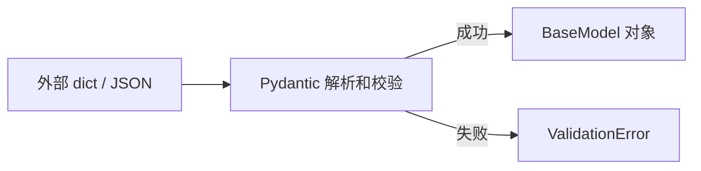
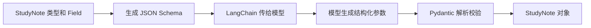

# 00 Pydantic 基础：让外部数据变成可靠的 Python 对象

## 1. 为什么现在需要学习 Pydantic

Agent 应用经常处理不可信的外部数据：

- 前端传来的 JSON
- 大模型生成的结构化参数
- Tool Calling 的工具参数
- RAG 检索结果
- 数据库和第三方接口返回值

这些数据即使看起来像 Python 字典，也不代表字段完整、类型正确或满足业务要求。

Pydantic 的作用是：**根据 Python 类型标注，解析并校验运行时数据，成功后生成一个类型明确的 Python 对象。**



当前 LangChain 练习中的 `StudyNote` 就是一个 Pydantic 模型：模型输出只有通过校验，才能成为 `StudyNote` 对象。

## 2. Python 类型标注为什么还不够

下面的代码虽然把 `age` 标注为 `int`，Python 运行时仍然允许传入字符串：

```python
def print_age(age: int) -> None:
    print(age)


print_age("18")  # Python 运行时不会自动拒绝
```

类型标注主要帮助：

- 开发者理解代码
- IDE 自动补全
- mypy、Pyright 等静态检查工具提前发现问题

但来自 HTTP、JSON 和大模型的数据只会在程序运行时出现，因此还需要运行时校验。Pydantic 就负责这一层。

## 3. 第一个 BaseModel

```python
from pydantic import BaseModel


class User(BaseModel):
    name: str
    age: int


user = User(name="张三", age=18)

print(user.name)  # 张三
print(user.age)   # 18
```

可以把 `BaseModel` 理解为“带运行时校验能力的数据类”。

创建 `User` 时，Pydantic 会：

1. 检查 `name` 和 `age` 是否存在
2. 检查或转换字段类型
3. 校验成功后创建 `User` 对象
4. 校验失败时抛出 `ValidationError`

成功后不再通过字典下标读取数据：

```python
user.name
```

而不是：

```python
data["name"]
```

## 4. Pydantic 默认会尝试类型转换

Pydantic 默认不是完全严格模式。对于能够安全理解的数据，它会尝试转换：

```python
user = User(name="张三", age="18")

print(user.age)        # 18
print(type(user.age))  # <class 'int'>
```

输入是字符串 `"18"`，结果却是整数 `18`。

这对 HTTP 和环境变量很方便，因为这些输入经常以字符串形式存在。但也必须知道：**校验通过不一定代表输入一开始就是正确类型，也可能是 Pydantic 转换成功了。**

需要严格类型时，可以使用严格模式：

```python
from pydantic import BaseModel, ConfigDict


class StrictUser(BaseModel):
    model_config = ConfigDict(strict=True)

    name: str
    age: int
```

此时 `age="18"` 会校验失败，因为字符串不再自动转换成整数。

生产项目不要无条件开启全局严格模式。应根据数据来源决定：环境变量可能需要转换，金额、权限标识等敏感字段可能更适合严格校验。

## 5. 必填、默认值和可空字段

```python
from pydantic import BaseModel


class UserProfile(BaseModel):
    user_id: str                 # 必填，不能是 None
    nickname: str = "新用户"     # 可以不传，默认是“新用户”
    email: str | None = None     # 可以不传，也可以传 None
```

三者区别：

| 定义 | 是否必须传 | 是否允许 `None` |
| --- | --- | --- |
| `name: str` | 是 | 否 |
| `name: str = "默认值"` | 否 | 否 |
| `name: str \| None` | 是 | 是 |
| `name: str \| None = None` | 否 | 是 |

在 Pydantic v2 中，`str | None` 只代表“允许为 `None`”，不代表“可以省略”。想让字段可以省略，需要提供默认值。

列表、字典等可变默认值推荐使用 `default_factory`：

```python
from pydantic import BaseModel, Field


class Conversation(BaseModel):
    messages: list[str] = Field(default_factory=list)
```

## 6. 使用 Field 添加约束

`Field` 可以给字段添加校验规则和说明：

```python
from pydantic import BaseModel, Field


class Product(BaseModel):
    product_id: str = Field(min_length=1, description="商品 ID")
    name: str = Field(min_length=1, max_length=100)
    price: float = Field(gt=0, description="商品售价，必须大于 0")
    stock: int = Field(ge=0, description="库存不能小于 0")
```

常见约束：

| 参数 | 含义 |
| --- | --- |
| `gt=0` | 必须大于 0 |
| `ge=0` | 必须大于或等于 0 |
| `lt=100` | 必须小于 100 |
| `le=100` | 必须小于或等于 100 |
| `min_length=1` | 字符串或列表至少包含一个元素 |
| `max_length=100` | 字符串或列表不能超过指定长度 |
| `pattern=...` | 字符串必须符合正则表达式 |
| `description=...` | 字段说明，也会进入 JSON Schema |

### description 不等于校验规则

当前练习写的是：

```python
key_points: list[str] = Field(description="三个关键知识点")
```

`description` 会告诉大模型“希望生成三个”，但 Pydantic 不会根据自然语言自动判断数量。因此模型返回一个或五个知识点，也可能通过校验。

如果必须正好三个，应写成：

```python
key_points: list[str] = Field(
    min_length=3,
    max_length=3,
    description="三个关键知识点",
)
```

记住这个区别：

```text
description：给人和大模型看的说明
类型与 Field 约束：程序真正执行的规则
```

## 7. 嵌套模型

真实 JSON 通常包含多层结构，可以把子结构拆成独立模型：

```python
from pydantic import BaseModel, Field


class Address(BaseModel):
    province: str
    city: str
    detail: str


class Order(BaseModel):
    order_id: str
    amount: float = Field(gt=0)
    address: Address


order = Order.model_validate(
    {
        "order_id": "order_1001",
        "amount": 299.0,
        "address": {
            "province": "广东省",
            "city": "深圳市",
            "detail": "南山区示例路 1 号",
        },
    }
)

print(order.address.city)  # 深圳市
```

Pydantic 会自动把内部字典转换为 `Address` 对象。

## 8. 从 dict 和 JSON 创建模型

### 8.1 校验 Python 字典

推荐使用 `model_validate()`：

```python
data = {"name": "张三", "age": 18}
user = User.model_validate(data)
```

### 8.2 校验 JSON 字符串

使用 `model_validate_json()`：

```python
json_text = '{"name":"张三","age":18}'
user = User.model_validate_json(json_text)
```

不要先手动用字符串切割 JSON。JSON 数据应该交给 JSON 解析器或 Pydantic 的结构化 API。

## 9. 把模型转换成 dict 和 JSON

### 9.1 转换成字典

```python
data = user.model_dump()
print(data)
```

结果：

```python
{"name": "张三", "age": 18}
```

### 9.2 转换成 JSON 字符串

```python
json_text = user.model_dump_json(indent=2)
print(json_text)
```

当前练习的 CLI 最后就是这样输出 `StudyNote`：

```python
print(note.model_dump_json(indent=2))
```

### 9.3 常见输出选项

```python
user.model_dump(exclude_none=True)  # 不输出值为 None 的字段
user.model_dump(exclude={"email"})  # 排除指定字段
```

排除字段只控制这一次输出，不等于数据脱敏和权限控制。敏感数据是否允许返回，仍应由业务层决定。

## 10. 处理 ValidationError

```python
from pydantic import BaseModel, ValidationError


class User(BaseModel):
    name: str
    age: int


try:
    User.model_validate({"name": "张三", "age": "不是数字"})
except ValidationError as error:
    print(error.errors())
```

`error.errors()` 会返回结构化错误列表，其中通常包含：

- `loc`：错误字段的位置
- `type`：错误类型
- `msg`：错误说明
- `input`：导致错误的输入

生产日志记录 `input` 时要小心，它可能包含手机号、地址、身份证号或大模型上下文等敏感数据。

## 11. 自定义字段校验器

类型和 `Field` 不能表达所有规则。简单的单字段规则可以使用 `field_validator`：

```python
from pydantic import BaseModel, field_validator


class User(BaseModel):
    username: str

    @field_validator("username")
    @classmethod
    def username_must_not_be_blank(cls, value: str) -> str:
        value = value.strip()
        if not value:
            raise ValueError("用户名不能为空")
        return value
```

执行顺序可以简单理解为：

```text
输入数据 -> 类型解析 -> 自定义校验 -> BaseModel 对象
```

不要把查询数据库、调用远程接口、检查用户权限等逻辑塞进 Pydantic 校验器。Pydantic 适合数据结构校验，业务规则仍由服务层负责。

## 12. Pydantic、dataclass 和 dict 的区别

| 方案 | 字段结构 | 运行时校验 | JSON 转换 | 适合场景 |
| --- | --- | --- | --- | --- |
| `dict` | 不固定 | 无 | 容易 | 临时、结构非常简单的数据 |
| `dataclass` | 固定 | 默认无 | 需要额外处理 | 程序内部可信数据 |
| `BaseModel` | 固定 | 有 | 内置支持 | API、配置、大模型和其他外部数据 |

Pydantic 不是所有 Python 类的替代品。领域对象包含复杂行为时，仍然可以使用普通类或 dataclass；在系统边界处再用 Pydantic 负责输入输出校验。

## 13. Pydantic 在 LangChain 中的工作流程

当前代码：

```python
class StudyNote(BaseModel):
    topic: str = Field(description="学习内容的主题")
    key_points: list[str] = Field(description="三个关键知识点")
    summary: str = Field(description="一句话总结")
```

绑定到模型：

```python
structured_model = model.with_structured_output(
    StudyNote,
    method="function_calling",
)
```

完整流程：



最终结果不是普通字典：

```python
note = structured_model.invoke("整理 Runnable 学习要点")

print(note.topic)
print(note.key_points)
print(note.summary)
```

## 14. Pydantic 能保证什么，不能保证什么

假设有退款请求：

```python
class RefundRequest(BaseModel):
    order_id: str
    amount: float = Field(gt=0)
```

Pydantic 可以保证：

- `order_id` 是字符串
- `amount` 是数字
- `amount` 大于 0

Pydantic 不能保证：

- 订单真实存在
- 当前用户拥有这个订单
- 订单允许退款
- 退款金额没有超过可退金额
- 相同退款没有重复执行

后面这些必须由数据库、权限系统、幂等机制和业务服务校验。

## 15. 当前阶段需要掌握的 API

先掌握下面这些就足够继续 LangChain 学习：

```text
BaseModel
Field
ValidationError
model_validate()
model_validate_json()
model_dump()
model_dump_json()
field_validator
```

暂时不需要深入：

- 自定义 Core Schema
- 高级序列化器
- 泛型模型
- 动态创建模型
- Pydantic 插件和底层性能实现

## 16. 自测问题

1. Python 类型标注和 Pydantic 校验有什么区别？
2. `BaseModel` 接收字典后会做哪些事情？
3. 为什么 `age="18"` 可能通过 `int` 字段校验？
4. `str | None` 和 `str | None = None` 有什么区别？
5. `description="三个知识点"` 为什么不能限制列表长度？
6. `model_validate()` 和 `model_dump()` 的方向有什么不同？
7. Pydantic 校验通过后，为什么仍然需要业务校验？
8. LangChain 如何使用 Pydantic 得到结构化输出？

## 17. 官方资料

- [Pydantic Models](https://docs.pydantic.dev/latest/concepts/models/)
- [Pydantic Fields](https://docs.pydantic.dev/latest/concepts/fields/)
- [Pydantic Validators](https://docs.pydantic.dev/latest/concepts/validators/)
- [Pydantic Serialization](https://docs.pydantic.dev/latest/concepts/serialization/)
- [Pydantic Validation Errors](https://docs.pydantic.dev/latest/errors/errors/)

> 本项目当前使用 Pydantic 2.13.4。网上使用 `parse_obj()`、`dict()`、`json()`、`@validator` 的内容大多是 Pydantic v1 写法；v2 新代码优先使用本笔记中的 API。

