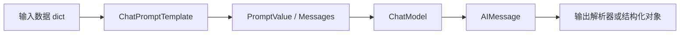

# 01 LangChain 基础：从原生调用到可组合链

> 前置知识：[00 Pydantic 基础](00-Pydantic基础.md)。如果还不熟悉 `BaseModel`、`Field` 和 `model_dump_json()`，建议先阅读这份笔记。

## 1. 这节课解决什么问题

前面的原生 Python 练习已经手动实现过：

- 构造 `messages`
- 调用大模型 API
- 解析模型返回值
- 循环执行工具
- 保存会话记忆

这些原理仍然有效。LangChain 不是替代这些原理，而是把常见步骤封装成统一对象，让它们可以组合、替换、测试和观测。

本课只学习五个基础能力：

1. `ChatModel`：统一的聊天模型接口
2. `Messages`：有明确角色的消息对象
3. `ChatPromptTemplate`：可复用的提示词模板
4. `Runnable`：统一执行接口和链式组合
5. `Structured Output`：让结果直接成为经过校验的 Python 对象

工具绑定和 Agent 循环会放到下一课。

## 2. 整体流程



最典型的 LangChain 表达式是：

```python
chain = prompt | model | parser
result = chain.invoke({"text": "需要处理的文本"})
```

这里的 `|` 不是字符串拼接。它把多个实现了 `Runnable` 协议的组件连接成 `RunnableSequence`：前一个组件的输出会成为后一个组件的输入。

## 3. ChatModel：统一模型调用接口

### 3.1 它是什么

`ChatModel` 可以理解为“聊天模型适配器”。它不是通常直接实例化的某个类：通用抽象是 `BaseChatModel`，`ChatOpenAI` 是其中一个具体实现。业务代码面对统一的 `invoke`、`stream`、`batch` 等接口，具体模型供应商的差异由对应集成包处理。

OpenAI 及 OpenAI-compatible 服务通常使用：

```python
from langchain_openai import ChatOpenAI

model = ChatOpenAI(
    model="your-model-name",
    api_key="your-api-key",
    base_url="https://example.com/v1",
    temperature=0,
)
```

调用方式：

```python
response = model.invoke("什么是 Agent？")
print(response.content)
```

`response` 通常是 `AIMessage`，不只是一个字符串。除正文外，它还可能携带工具调用、token 用量、响应 ID 等元数据。

### 3.2 与原生 SDK 的关系

原生 SDK 常见写法：

```python
response = client.chat.completions.create(
    model=model_name,
    messages=messages,
)
answer = response.choices[0].message.content
```

LangChain 写法：

```python
response = model.invoke(messages)
answer = response.content
```

LangChain 减少的是不同模型之间的接入差异，不会替你解决权限、幂等、业务校验、超时重试和数据真实性问题。

## 4. Messages：带角色的消息

### 4.1 常见消息类型

| 类型 | 对应角色 | 主要用途 |
| --- | --- | --- |
| `SystemMessage` | system | 定义长期规则、身份和行为边界 |
| `HumanMessage` | user | 用户本轮输入 |
| `AIMessage` | assistant | 模型回答，也可能包含工具调用 |
| `ToolMessage` | tool | 工具执行后返回给模型的结果 |

示例：

```python
from langchain.messages import HumanMessage, SystemMessage
from langchain_core.messages import BaseMessage  # 仅在需要基类类型标注时导入

messages: list[BaseMessage] = [
    SystemMessage(content="你是 Agent 开发导师，回答要准确简洁。"),
    HumanMessage(content="什么是 Runnable？"),
]

response = model.invoke(messages)
```

当前 `langchain.messages` 会重新导出常用的具体消息类，但不导出 `BaseMessage`。需要给消息列表添加通用类型标注时，应从 `langchain_core.messages` 导入 `BaseMessage`。

### 4.2 为什么不一直使用字典

原生字典仍然能表达消息，但消息类有三个优势：

- 类型更明确，编辑器和类型检查工具更容易发现错误
- 能表达工具调用、工具结果等更复杂的数据
- 能直接参与 LangChain 的模板、历史记录和 Runnable 组合

消息类型只是结构化表达，不会自动防止提示词注入。系统权限仍必须由业务代码控制。

## 5. ChatPromptTemplate：可复用模板

### 5.1 基本用法

```python
from langchain_core.prompts import ChatPromptTemplate

prompt = ChatPromptTemplate.from_messages(
    [
        ("system", "你是一名{role}，只根据输入内容回答。"),
        ("human", "请总结以下内容：\n{text}"),
    ]
)

prompt_value = prompt.invoke(
    {
        "role": "Agent 开发导师",
        "text": "LangChain 为模型调用提供统一的可组合接口。",
    }
)
```

模板负责把输入变量变成消息，模型负责推理。把两者分开后，同一个模型可以复用多套模板，同一套模板也可以切换模型。

### 5.2 模板不是普通字符串替换工具

模板的输出是 `PromptValue`，它可以继续转换为消息列表：

```python
messages = prompt_value.to_messages()
```

生产环境要注意：

- 明确区分系统指令、外部知识和用户输入
- 不要把用户输入直接拼进系统规则
- 外部数据即使放进模板，也仍然是不可信输入
- 模板只负责组织上下文，不负责业务权限

## 6. Runnable：LangChain 的统一执行协议

### 6.1 四个常见执行方法

| 方法 | 用途 |
| --- | --- |
| `invoke(input)` | 同步处理单个输入 |
| `ainvoke(input)` | 异步处理单个输入 |
| `batch(inputs)` | 批量处理多个输入 |
| `stream(input)` | 流式返回结果 |

并不是每个场景都应该立刻使用异步或批处理。学习阶段先掌握 `invoke`，在线服务再根据吞吐和延迟要求选择执行方式。

### 6.2 使用 `|` 组合

```python
from langchain_core.output_parsers import StrOutputParser

chain = prompt | model | StrOutputParser()
answer = chain.invoke({"text": "LangChain 基础内容"})
```

数据依次发生三次转换：

```text
{"text": "..."}
    -> PromptValue
    -> AIMessage
    -> str
```

`StrOutputParser` 把 `AIMessage` 的正文转换成字符串，所以调用方不再需要手动读取 `response.content`。

### 6.3 组合的真正价值

链式写法的价值不只是少写几行代码，而是形成清晰边界：

- 模板只负责构造输入
- 模型只负责推理
- 解析器只负责转换输出
- 每一部分都能单独替换和测试

一条链不应该无限变长。复杂流程涉及分支、循环、状态和人工确认时，应进入 LangGraph 等工作流方案，而不是继续堆叠线性 `|`。

## 7. Structured Output：结构化输出

### 7.1 为什么仅要求“返回 JSON”不够

下面的提示词约束比较弱：

```text
请只返回 JSON，字段为 topic、key_points、summary。
```

模型仍可能返回 Markdown 代码块、漏字段、字段类型错误或额外说明。业务代码还需要解析和校验。

LangChain 可以结合 Pydantic 定义结果结构：

```python
from pydantic import BaseModel, Field


class StudyNote(BaseModel):
    topic: str = Field(description="主题")
    key_points: list[str] = Field(description="关键知识点")
    summary: str = Field(description="一句话总结")
```

然后让模型按这个结构输出：

```python
structured_model = model.with_structured_output(
    StudyNote,
    method="function_calling",
)

note = structured_model.invoke("整理 Runnable 的学习要点")
print(note.topic)
print(note.key_points)
```

当传入 Pydantic 模型时，成功结果会直接成为 `StudyNote` 对象，并经过字段类型校验。

### 7.2 `function_calling` 的含义

这里借用了模型的工具调用能力来约束参数结构，但不会执行真实业务工具。模型只是按照 `StudyNote` 的 schema 生成参数，LangChain 再把参数解析成对象。

不同供应商对结构化输出方式的支持并不完全相同。使用 OpenAI-compatible 服务时，需要确认它是否正确实现 tool calling；不能只看接口地址兼容。

OpenAI-compatible 通常只说明请求路径和主要字段相似，并不保证原生 `json_schema`、Responses API、流式 token 用量等扩展能力完全兼容。本练习显式使用兼容面更广的 `function_calling`，上线前仍要用目标模型做集成测试。

`ChatOpenAI.with_structured_output()` 常见的三种模式是：

| 模式 | 约束方式 | 注意事项 |
| --- | --- | --- |
| `function_calling` | 使用工具调用参数 schema | 兼容服务也必须支持 Tool Calling |
| `json_schema` | 使用 OpenAI 原生 Structured Outputs | 只适用于明确支持该能力的模型和接口 |
| `json_mode` | 要求模型返回合法 JSON | 提示词仍需说明字段，约束相对更弱 |

生产环境排查解析问题时，可以研究 `include_raw=True`。它会同时保留模型原始消息、解析结果和解析错误；但日志中可能包含用户数据，必须先做脱敏和访问控制。

### 7.3 结构化输出仍需业务校验

类型正确不代表业务正确。例如退款金额是数字，不代表它没有超过订单可退金额。因此仍需要：

- Pydantic：格式和基本类型校验
- 业务服务：权限、状态、金额、幂等校验
- 数据来源：真实性与时效性校验

## 8. 本课完整案例

本项目的 `practice/05-langchain-basics` 实现了三个运行模式：

```text
chat       消息对象 -> ChatModel -> AIMessage
summary    Prompt Template -> ChatModel -> StrOutputParser
structured Prompt Template -> structured model -> StudyNote
```

运行前配置：

```powershell
Copy-Item .env.example .env
```

安装整个 workspace：

```powershell
python -m uv sync --all-packages
```

进入练习目录后运行：

```powershell
python -m uv run langchain-basics --mode chat
python -m uv run langchain-basics --mode summary
python -m uv run langchain-basics --mode structured
```

## 9. 生产环境边界

学习完本课后，需要明确下面这些责任不属于 LangChain 基础封装：

| 问题 | 应负责的层 |
| --- | --- |
| 用户能否退款 | 权限系统和业务服务 |
| 重复退款如何拦截 | 幂等与数据库约束 |
| 模型超时是否重试 | 应用层重试策略 |
| 输出字段是否合法 | Pydantic + 业务校验 |
| 外部知识是否最新 | RAG 数据治理 |
| 复杂 Agent 如何循环 | Agent/LangGraph 工作流 |

LangChain 是编排和集成工具，不是业务安全边界。

## 10. 学完后的自测问题

1. `ChatModel` 和真实大模型是什么关系？
2. `AIMessage` 为什么不直接设计成字符串？
3. `ChatPromptTemplate` 的输入和输出分别是什么？
4. `prompt | model | parser` 中数据如何变化？
5. `invoke`、`batch`、`stream` 分别适合什么场景？
6. 结构化输出为什么比“提示模型返回 JSON”更可靠？
7. Pydantic 校验通过后，为什么仍然需要业务校验？

## 11. 官方资料

- [LangChain Installation](https://docs.langchain.com/oss/python/langchain/install)
- [ChatOpenAI Integration](https://docs.langchain.com/oss/python/integrations/chat/openai)
- [LangChain Models](https://docs.langchain.com/oss/python/langchain/models)
- [LangChain Messages](https://docs.langchain.com/oss/python/langchain/messages)
- [LangChain Structured Output](https://docs.langchain.com/oss/python/langchain/structured-output)
- [BaseChatModel API Reference](https://reference.langchain.com/python/langchain-core/language_models/chat_models/BaseChatModel)
- [ChatPromptTemplate API Reference](https://reference.langchain.com/python/langchain-core/prompts/ChatPromptTemplate)
- [Runnable API Reference](https://reference.langchain.com/python/langchain-core/runnables/Runnable)
- [ChatOpenAI API Reference](https://reference.langchain.com/python/integrations/langchain_openai/ChatOpenAI)

> 本课代码已使用 Python 3.11、`langchain==1.3.14`、`langchain-openai==1.3.5` 验证。不要照搬仍使用 `LLMChain.run()` 的旧版教程；当前新代码优先使用 Runnable、`|` 和 `invoke()`。
