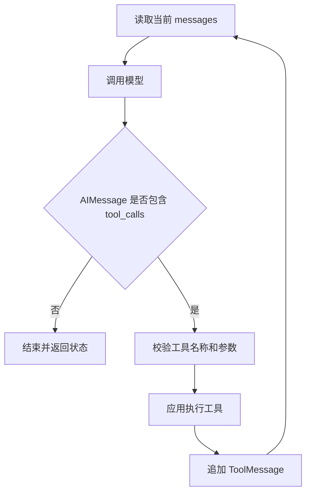

# 07 智能体

> 来源：`尚硅谷-07-智能体.pdf`。本章聚焦 LangChain 1.x 的 `create_agent()`。

## 学习目标

- 理解 Agent 与单次模型调用、Tool Calling 的区别
- 使用 `create_agent()` 创建并调用单 Agent
- 看懂模型、工具、状态之间的循环
- 配置名称、系统提示词与结构化响应
- 掌握 Agent 的流式输出模式
- 识别工具选择、重试和终止方面的常见问题

## 1. 什么是 Agent

Agent 是一个由模型驱动的执行系统。它会根据当前消息和状态决定下一步动作，调用工具观察结果，再判断是否继续。

```text
用户目标
  -> 模型判断
  -> 直接回答，或提出 Tool Call
  -> 应用执行 Tool
  -> ToolMessage 回到状态
  -> 模型再次判断
  -> 最终回答或继续行动
```

Agent 的常见组成：

| 组件 | 作用 |
|---|---|
| Model | 理解问题、选择行动、组织答案 |
| Tools | 访问搜索、数据库、业务服务等外部能力 |
| Instructions | 规定角色、边界和执行要求 |
| State | 保存消息和当前任务数据 |
| Runtime Context | 注入用户、租户、权限等可信运行信息 |
| Middleware | 在模型或工具调用前后增加控制逻辑 |
| Checkpointer / Store | 保存短期状态和长期记忆 |

并非每个 Agent 都需要复杂规划和长期记忆，但“根据结果决定下一步行动”是核心特征。

### 1.1 Agent 不等于 Tool Calling

一次 Tool Calling 只代表模型提出了一次工具请求。Agent 在其上增加了状态与循环：

```text
Tool Calling：Model -> Tool Call
Agent：Model -> Tool -> Observation -> Model -> ... -> Answer
```

### 1.2 Agent 的底层形态

LangChain 1.x 的 `create_agent()` 返回 LangGraph 的 `CompiledStateGraph`。因此它天然支持状态、节点循环、流式事件、持久化和中间件。

## 2. 创建 Agent

最小示例：

```python
from langchain.agents import create_agent

agent = create_agent(
    model="openai:your-model",
    tools=[],
    system_prompt="你是一名简洁、准确的中文助手。",
)
```

`create_agent()` 的主要参数：

| 参数 | 作用 |
|---|---|
| `model` | 模型字符串或 `BaseChatModel` 对象 |
| `tools` | Agent 可以选择的工具 |
| `system_prompt` | 固定系统指令 |
| `middleware` | 中间件列表 |
| `response_format` | 最终结构化响应 Schema 或策略 |
| `state_schema` | 扩展 Agent State |
| `context_schema` | 静态运行上下文类型 |
| `checkpointer` | 短期记忆和线程状态 |
| `store` | 长期记忆存储 |
| `interrupt_before/after` | 指定节点前后中断 |
| `name` | Agent 名称 |
| `debug` | 输出图执行调试信息 |

## 3. 两种模型传入方式

### 3.1 模型字符串

```python
agent = create_agent(
    model="openai:your-model",
    tools=[],
)
```

优点是简洁，适合使用标准配置的场景。

### 3.2 模型对象

```python
from langchain.chat_models import init_chat_model

model = init_chat_model(
    model="your-model",
    model_provider="openai",
    api_key=api_key,
    base_url=base_url,
    temperature=0.1,
)

agent = create_agent(model=model, tools=[])
```

需要自定义 Base URL、超时、重试、兼容参数或提供商特有能力时，应传模型对象。

## 4. 调用 Agent

Agent 输入是状态字典，最常用字段是 `messages`：

```python
result = agent.invoke(
    {
        "messages": [
            {"role": "user", "content": "解释一下什么是 Agent"},
        ]
    }
)

final_message = result["messages"][-1]
print(final_message.content)
```

结果不是单个 `AIMessage`，而是更新后的状态：

```python
{
    "messages": [
        HumanMessage(...),
        AIMessage(...),
    ]
}
```

使用工具时，消息可能变成：

```text
HumanMessage
AIMessage(tool_calls=[...])
ToolMessage
AIMessage(final answer)
```

每次没有配置 Checkpointer 的独立 `invoke()` 都是一次新状态。多轮记忆将在第 09 章处理。

## 5. 绑定工具

```python
from langchain.agents import create_agent
from langchain_core.tools import tool


@tool
def get_weather(city: str) -> str:
    """查询指定城市当前天气。"""
    return f"{city}当前晴，25 摄氏度"


agent = create_agent(
    model=model,
    tools=[get_weather],
    system_prompt="需要实时天气时必须使用工具。",
)
```

调用：

```python
result = agent.invoke(
    {"messages": [{"role": "user", "content": "北京天气怎么样？"}]}
)
```

### 5.1 内部执行循环



模型只生成工具名称和参数，应用程序才真正执行工具。数据库权限、用户身份、幂等键和审批不能信任模型生成。

### 5.2 工具数量与描述

工具越多，模型选择越困难。应当：

- 只暴露当前场景需要的工具
- 保持工具名称稳定且区别明显
- 在 Docstring 中写明使用条件和边界
- 避免多个工具描述高度重叠
- 需要时通过中间件动态筛选可用工具

“2 到 5 个最佳”只能作为经验参考，不是框架限制。实际数量要用任务测试集评估。

## 6. System Prompt

创建时固定系统提示词：

```python
agent = create_agent(
    model=model,
    tools=[get_weather],
    system_prompt="""
你是天气助手。
- 查询实时天气必须调用 get_weather。
- 不确定城市时先询问用户。
- 不要编造工具没有返回的信息。
""".strip(),
)
```

也可以在输入消息中传 `system` 消息，但通用且必须执行的指令更适合放在 `system_prompt`。需要按用户、权限或状态动态生成指令时，使用 `dynamic_prompt` 中间件。

## 7. Agent 名称

```python
agent = create_agent(
    model=model,
    tools=[get_weather],
    name="weather_assistant",
)
```

名称用于：

- 标识 Trace 和流式事件来源
- 区分嵌套 Agent 或后续多 Agent 节点
- 帮助前端展示当前执行主体

名称不会自动改变 Agent 能力和权限。

## 8. 工具失败、重试与终止

### 8.1 Agent 为什么会再次调用工具

模型看到工具错误、信息不完整或结果不符合预期时，可能再次提出 Tool Call。这是模型基于观察结果做出的下一步行动，不等于底层 HTTP 客户端重试。

### 8.2 三类重试要区分

| 层级 | 示例 | 负责方 |
|---|---|---|
| 模型请求重试 | 限流、临时网络错误 | 模型客户端 / ModelRetryMiddleware |
| 工具执行重试 | 查询服务临时超时 | 业务工具 / ToolRetryMiddleware |
| Agent 再规划 | 更换参数或选择另一工具 | 模型和 Agent 循环 |

生产环境必须设置：

- 模型调用次数上限
- 单工具和总工具调用次数上限
- 超时和有限重试
- 写操作幂等
- 未知状态下的查询与人工处理

重试策略和调用上限将在第 08 章中间件中展开。

## 9. 常见问题

### 9.1 选错工具

检查顺序：

1. 工具名称和描述是否重叠。
2. System Prompt 是否写清使用条件。
3. 是否给了无关工具。
4. 输入是否缺少关键上下文。
5. 当前模型的 Tool Calling 是否稳定。

### 9.2 参数错误

使用 Pydantic Schema、枚举和范围约束，并在工具执行前做业务校验。不能只靠提示词修正。

### 9.3 重复调用

读取工具可在受控次数内重试；写工具必须由业务服务保证幂等，并结合中间件设置调用上限和人工审批。

### 9.4 死循环

设置 `ModelCallLimitMiddleware`、`ToolCallLimitMiddleware` 或图递归上限。超过上限时返回明确失败，而不是继续消耗 Token。

## 10. 结构化最终响应

Agent 不仅能调用工具，还可以让最终结果符合 Schema：

```python
from pydantic import BaseModel, Field


class ContactInfo(BaseModel):
    name: str = Field(description="联系人姓名")
    email: str | None = Field(default=None, description="邮箱")
    phone: str | None = Field(default=None, description="电话")


agent = create_agent(
    model=model,
    tools=[],
    response_format=ContactInfo,
)

result = agent.invoke(
    {
        "messages": [
            {
                "role": "user",
                "content": "提取联系人：张三，邮箱 zhangsan@example.com",
            }
        ]
    }
)

contact = result["structured_response"]
```

结构化结果保存在 `structured_response`，消息历史仍保存在 `messages`。

### 10.1 自动策略

直接传 Schema 类型时，LangChain 会根据模型能力选择合适策略：

```python
response_format=ContactInfo
```

一般逻辑是：

```text
提供商支持原生结构化输出 -> ProviderStrategy
否则支持 Tool Calling -> ToolStrategy
```

模型能力声明和兼容平台可能不准确，仍需真实调用测试。

### 10.2 `ProviderStrategy`

```python
from langchain.agents.structured_output import ProviderStrategy

agent = create_agent(
    model=model,
    response_format=ProviderStrategy(ContactInfo),
)
```

它使用提供商原生 Structured Output，约束通常更稳定，但依赖模型支持。

### 10.3 `ToolStrategy`

```python
from langchain.agents.structured_output import ToolStrategy

agent = create_agent(
    model=model,
    response_format=ToolStrategy(
        ContactInfo,
        tool_message_content="联系人信息已格式化。",
    ),
)
```

它把结构化输出模拟为一次特殊工具调用。LangChain 会补齐相应 `ToolMessage`，但这不是实际业务工具执行。

`tool_message_content` 可以控制写入历史的确认文本，避免把完整结构重复放入上下文。

### 10.4 错误处理

ToolStrategy 可能遇到：

- 一次返回多个结构化结果
- 字段校验失败
- 模型始终不能满足 Schema

可以配置 `handle_errors` 控制哪些异常允许框架反馈给模型后重试。重试必须有限，并应记录最终异常。

## 11. 流式输出

`invoke()` 等 Agent 完整结束后才返回；`stream()` 可以逐步观察执行。

```python
for chunk in agent.stream(
    {"messages": [{"role": "user", "content": "查询北京天气"}]},
    stream_mode="updates",
):
    print(chunk)
```

### 11.1 `values`

每次状态变化后输出完整状态快照：

```python
for state in agent.stream(input_data, stream_mode="values"):
    print(state["messages"][-1])
```

适合学习和调试，但数据量可能较大。

### 11.2 `updates`

只输出每个节点本次新增或修改的字段：

```python
for update in agent.stream(input_data, stream_mode="updates"):
    print(update)
```

适合展示模型节点、工具节点分别做了什么。

### 11.3 `messages`

输出模型生成的消息 Token/Chunk 及其元数据：

```python
for message_chunk, metadata in agent.stream(
    input_data,
    stream_mode="messages",
):
    print(message_chunk.content, end="")
```

适合前端逐字展示最终答案，也可能包含中间模型调用内容，前端应按节点元数据过滤。

### 11.4 `custom`

工具或节点通过 Stream Writer 主动发送自定义进度：

```text
正在查询订单
正在核对库存
正在生成总结
```

适合长任务进度条，但不要暴露模型隐藏推理或敏感内部数据。

### 11.5 `checkpoints`

输出 Checkpointer 保存的检查点事件，用于观察持久化状态变化。通常需要配置 Checkpointer。

### 11.6 `tasks`

输出节点任务开始、完成和错误等事件，适合分析图执行过程。

### 11.7 `debug`

输出最详细的调试事件。信息量大，只适合开发诊断，不应原样暴露给最终用户。

### 11.8 多种模式同时使用

```python
for mode, chunk in agent.stream(
    input_data,
    stream_mode=["messages", "updates"],
):
    print(mode, chunk)
```

流式模式是否全部可用、事件的细节结构，取决于 LangChain/LangGraph 版本和具体模型集成。

## 12. 一个完整的多功能助手

```python
from langchain.agents import create_agent
from langchain_core.tools import tool
from pydantic import BaseModel, Field


@tool
def get_weather(city: str) -> str:
    """查询指定城市当前天气。"""
    return f"{city}晴，25 摄氏度"


@tool
def search_news(keyword: str) -> list[str]:
    """查询指定关键词的最新新闻标题。"""
    return [f"关于 {keyword} 的新闻示例"]


class AssistantAnswer(BaseModel):
    answer: str = Field(description="给用户的最终答案")
    sources: list[str] = Field(default_factory=list)


agent = create_agent(
    model=model,
    tools=[get_weather, search_news],
    system_prompt="""
你是信息查询助手。
- 实时信息必须使用工具。
- 只根据工具结果回答，不要补造数据。
- 缺少必要参数时先询问用户。
""".strip(),
    response_format=AssistantAnswer,
    name="information_assistant",
)

result = agent.invoke(
    {
        "messages": [
            {"role": "user", "content": "北京天气如何，并给我两条相关新闻"}
        ]
    }
)

print(result["structured_response"])
```

真实生产项目还要增加超时、限流、权限、幂等、人工审批、Checkpointer 和可观测性。

## 总结

```text
create_agent：构建基于 LangGraph 的 Agent
messages：Agent 的主要输入和状态
Model -> Tool -> ToolMessage -> Model：核心循环
name：标识 Agent 和事件来源
system_prompt：固定行为边界
response_format：最终结构化响应
ProviderStrategy：提供商原生结构化输出
ToolStrategy：借助工具调用完成结构化输出
stream：观察状态、更新、消息和调试事件
```

Agent 的价值不是“自动调用工具”本身，而是根据工具观察结果持续决定下一步。执行权限和业务安全始终属于应用程序。
