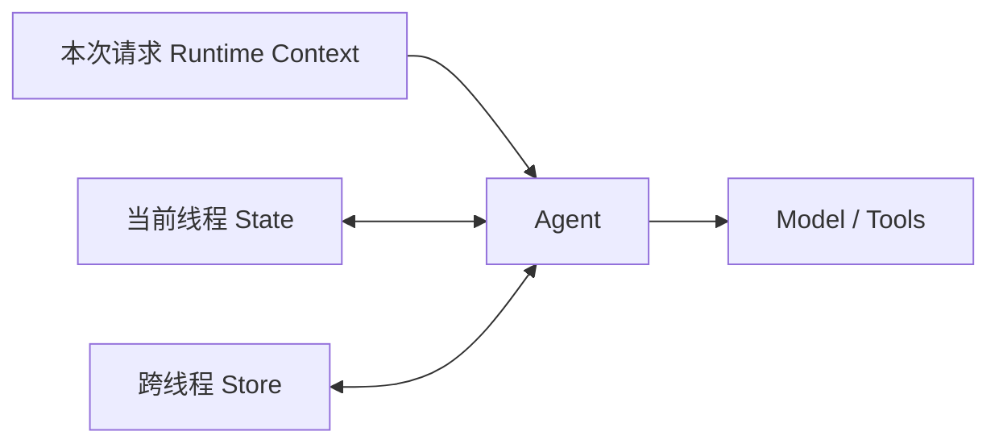
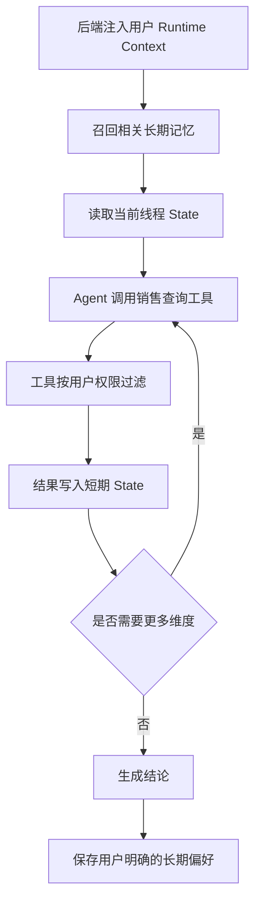

# 09 上下文与记忆

> 来源：`尚硅谷-09-上下文与记忆.pdf`。本章以 LangChain 1.x 和 LangGraph 的 State、Checkpointer、Store、Runtime Context 为主。

## 学习目标

- 理解模型为什么默认不记得上一轮对话
- 区分短期记忆、长期记忆和静态运行上下文
- 使用 Checkpointer 和 `thread_id` 保存线程状态
- 使用裁剪、删除和摘要治理上下文
- 使用 Store 保存并检索跨会话记忆
- 在 Tool 和 Middleware 中安全访问运行上下文与 Store

## 1. 模型为什么没有自动记忆

模型 API 的一次请求只处理本次传入的消息：

```text
请求 1：[用户：我叫张三]
请求 2：[用户：我叫什么？]
```

如果请求 2 没带请求 1 的内容，模型不知道“我”是谁。聊天应用的连续性来自应用层重新传入历史，而不是模型内部自动保存了对话。

```text
用户新消息
  -> 应用读取历史状态
  -> 历史 + 新消息一起交给模型
  -> 保存本轮新状态
```

## 2. 三种上下文

LangGraph 中最重要的三类上下文如下：

| 类型 | 是否可变 | 生命周期 | 典型内容 | 主要 API |
|---|---|---|---|---|
| State / 短期记忆 | 可变 | 一个线程 | 消息、工具结果、任务进度 | Checkpointer |
| Store / 长期记忆 | 可变 | 跨线程、跨会话 | 用户偏好、事实、经验 | `BaseStore` |
| Runtime Context | 通常不可变 | 一次调用 | 当前用户、租户、权限、配置 | `context_schema` |



三个概念不能混用：

- 用户身份应由后端放入 Runtime Context，不让模型猜测。
- 当前 Tool Call 和消息历史放在 State。
- “以后默认用中文回答”这类跨会话偏好才适合 Store。

## 3. 短期记忆：Checkpointer

短期记忆是同一线程内的状态。LangGraph 使用 Checkpointer 在执行过程中保存状态检查点。

### 3.1 `InMemorySaver`

```python
from langchain.agents import create_agent
from langgraph.checkpoint.memory import InMemorySaver

checkpointer = InMemorySaver()

agent = create_agent(
    model=model,
    tools=tools,
    checkpointer=checkpointer,
)
```

调用时必须传 `thread_id`：

```python
config = {
    "configurable": {
        "thread_id": "conversation-001",
    }
}

agent.invoke(
    {"messages": [{"role": "user", "content": "我叫张三"}]},
    config=config,
)

result = agent.invoke(
    {"messages": [{"role": "user", "content": "我叫什么？"}]},
    config=config,
)
```

第二次调用只传新消息。Checkpointer 会读取同一线程已有 State，再通过消息 Reducer 追加新消息。

### 3.2 `thread_id` 的作用

```text
相同 thread_id -> 延续同一状态
不同 thread_id -> 开始独立状态
```

```python
alice_config = {"configurable": {"thread_id": "alice-001"}}
bob_config = {"configurable": {"thread_id": "bob-001"}}
```

`thread_id` 是状态分区键，不一定等于用户 ID：

- 一个用户可以有多个会话线程
- 一个工作流任务也可以单独占一个线程
- 多个用户绝不能误用同一个线程

生产中应由后端生成并校验线程归属，不能直接信任前端传来的任意 ID。

### 3.3 查看状态

```python
snapshot = agent.get_state(config)

print(snapshot.values)
print(snapshot.next)
print(snapshot.config)
```

`values` 是当前 State，`next` 表示下一步待执行节点。中断和恢复时，这些信息尤其重要。

Checkpointer 在图执行的检查点保存状态，不是每生成一个 Token 就写一次数据库。具体保存时机由图的超步、节点执行和持久化配置决定。

### 3.4 `InMemorySaver` 的边界

它只适合本地学习、测试和单进程临时状态：

- 进程退出后数据消失
- 多实例之间不共享
- 不能可靠支持服务重启后恢复
- 内存会随线程和消息增长

生产环境应选择外部 Checkpointer，例如 PostgreSQL：

```python
from langgraph.checkpoint.postgres import PostgresSaver

with PostgresSaver.from_conn_string(database_uri) as checkpointer:
    checkpointer.setup()
    agent = create_agent(
        model=model,
        tools=tools,
        checkpointer=checkpointer,
    )
```

部署时还要考虑数据库连接池、迁移、备份、TTL、加密和租户隔离。

## 4. 短期记忆会无限增长吗

默认追加所有消息时，State 会持续增长：

```text
更多 Token 成本
-> 响应更慢
-> 超过模型上下文窗口
-> 关键信息被大量历史稀释
-> 模型更容易引用过时要求
```

记忆治理不是“把所有历史都保存后全部发给模型”，而是决定哪些信息进入当前上下文。

## 5. 记忆治理策略

### 5.1 裁剪消息

可以在 `before_model` 中只保留最近消息：

```python
from langchain.agents.middleware import AgentState, before_model
from langchain_core.messages import RemoveMessage
from langgraph.graph.message import REMOVE_ALL_MESSAGES
from langgraph.runtime import Runtime


@before_model
def trim_messages(state: AgentState, runtime: Runtime):
    messages = state["messages"]
    if len(messages) <= 10:
        return None

    kept = messages[-10:]
    return {
        "messages": [
            RemoveMessage(id=REMOVE_ALL_MESSAGES),
            *kept,
        ]
    }
```

`RemoveMessage` 是 LangChain 内置消息类型。它不是直接修改列表，而是向消息 Reducer 表达删除操作。

注意保持消息协议完整：

- 不要保留孤立的 `ToolMessage`
- `AIMessage.tool_calls` 后应有对应工具结果
- System Message 和任务关键约束不能随意丢失

### 5.2 删除指定消息

```python
return {
    "messages": [
        RemoveMessage(id=old_message.id),
    ]
}
```

消息必须有稳定 ID。删除标记被 Reducer 应用后，最终有效状态中不再包含目标消息。

### 5.3 自动摘要

第 08 章的 `SummarizationMiddleware` 可以在历史达到阈值时生成摘要：

```python
from langchain.agents.middleware import SummarizationMiddleware

summary = SummarizationMiddleware(
    model=summary_model,
    trigger=("tokens", 8_000),
    keep=("messages", 20),
)
```

摘要适合保留：

- 用户目标
- 已完成步骤
- 关键决策及原因
- 重要工具结果
- 未完成事项

摘要不适合单独承载：

- 精确金额和业务状态
- 权限和身份凭证
- 幂等键
- 必须逐字保留的法律文本

这些内容应进入结构化 State 或业务数据库。

### 5.4 自定义过滤

可以按消息类型、时间、来源、重要性或 Tool 名称过滤。例如只清理较早的大型搜索结果，保留最近用户目标和审批结果。

治理时要区分：

```text
持久化历史：为了审计和恢复而保存
模型上下文：本次推理真正发送给模型
```

持久化了不代表每轮都必须全部发给模型。

## 6. 自定义 State

Agent 默认 State 主要包含 `messages` 和结构化响应等字段。业务需要显式状态时可以扩展：

```python
from langchain.agents import AgentState


class OrderAgentState(AgentState):
    order_id: str | None
    task_status: str
    retry_count: int
```

```python
agent = create_agent(
    model=model,
    tools=tools,
    state_schema=OrderAgentState,
    checkpointer=checkpointer,
)
```

适合放入 State 的内容：

- 当前任务阶段
- 已确认订单号
- 工具结果摘要
- 审批状态
- 本次执行计数

不要把 API Key、密码和无需持久化的敏感凭证放入 State，因为 Checkpointer 可能长期保存完整状态。

## 7. 长期记忆是什么

长期记忆跨线程、跨会话存在，常见三类：

### 7.1 Semantic Memory

事实与偏好：

- 用户偏好中文和简洁回答
- 用户负责华东区域客户
- 默认销售额指含税销售额

### 7.2 Episodic Memory

过去发生过的事件和案例：

- 某次故障的定位与处理过程
- 用户上次完成了哪项任务
- 某类请求曾采用什么成功方案

### 7.3 Procedural Memory

执行规则和经验：

- 退款前必须先核对订单状态
- 报表生成后要进行数据完整性检查
- 特定团队的审批流程

过程性规则如果属于正式业务制度，应优先由代码、配置和权限系统维护，而不是只保存在自然语言记忆中。

## 8. Store 数据模型

LangGraph Store 使用三层结构：

```text
namespace -> key -> value
```

示例：

```python
namespace = ("users", "user-123", "preferences")
key = "profile"
value = {
    "language": "zh-CN",
    "answer_style": "concise",
}
```

### 8.1 Namespace

Namespace 是字符串元组，用于分层隔离：

```text
("users", "user-123", "preferences")
("users", "user-123", "memories")
("tenants", "tenant-a", "procedures")
```

多租户系统应把租户 ID 和用户 ID 都放入命名空间，并由后端从可信身份生成。

### 8.2 Key

Key 在 Namespace 内唯一，例如：

```text
profile
default_filters
decision-2026-001
```

重复 `put()` 同一 Namespace 和 Key 会更新现有记录，而不是新增另一条同 Key 记录。

### 8.3 Value

Value 是可序列化的字典。建议附带：

```python
{
    "content": "用户默认使用中文回答",
    "source": "explicit_user_request",
    "created_at": "2026-07-26T10:00:00+08:00",
    "confidence": 1.0,
}
```

来源、时间和置信度有助于判断记忆是否过时或冲突。

## 9. 使用 `InMemoryStore`

```python
from langgraph.store.memory import InMemoryStore

store = InMemoryStore()

namespace = ("users", "user-123", "preferences")

store.put(
    namespace,
    "profile",
    {
        "language": "zh-CN",
        "answer_style": "concise",
    },
)
```

读取单条：

```python
item = store.get(namespace, "profile")
if item is not None:
    print(item.value)
```

按 Namespace 前缀搜索：

```python
items = store.search(
    ("users", "user-123"),
    limit=10,
)
```

按字段过滤：

```python
items = store.search(
    ("users", "user-123", "memories"),
    filter={"category": "preference"},
)
```

`InMemoryStore` 同样只适合学习和测试。生产环境可以使用 PostgreSQL Store，并配置连接、迁移、索引和数据生命周期。

## 10. 语义检索

Store 配置 Embedding 索引后，可以按自然语言相似度召回长期记忆：

```python
items = store.search(
    ("users", "user-123", "memories"),
    query="用户喜欢什么回答风格",
    limit=3,
)
```

索引配置通常需要：

- Embedding 模型
- 向量维度
- Value 中参与索引的字段路径

字段索引可以控制哪些内容生成向量；某条记录也可以通过 `index=False` 不参与语义索引。

语义相似度不等于事实正确：

- 相似内容可能属于不同时间或场景
- 旧偏好可能已失效
- 同一句话在不同业务上下文中含义不同

召回后应结合 Namespace、结构化过滤、时间和来源再次筛选。

## 11. 在 Agent 中接入 Store

```python
agent = create_agent(
    model=model,
    tools=[save_preference, read_preferences],
    store=store,
    context_schema=UserContext,
)
```

### 11.1 在 Tool 中访问 Store

```python
from dataclasses import dataclass

from langchain.tools import ToolRuntime, tool


@dataclass
class UserContext:
    user_id: str


@tool
def save_preference(
    preference: str,
    runtime: ToolRuntime[UserContext],
) -> str:
    """保存用户明确要求长期使用的偏好。"""
    user_id = runtime.context.user_id
    namespace = ("users", user_id, "preferences")

    runtime.store.put(
        namespace,
        "answer-style",
        {"content": preference},
    )
    return "偏好已保存"
```

`runtime` 由框架注入，不应让模型生成。它可以提供：

- `runtime.context`：本次可信调用上下文
- `runtime.store`：长期记忆 Store
- `runtime.state`：当前线程 State
- 流式写入等运行能力

### 11.2 读取长期记忆

```python
@tool
def read_preferences(runtime: ToolRuntime[UserContext]) -> list[str]:
    """读取当前用户保存的长期偏好。"""
    namespace = ("users", runtime.context.user_id, "preferences")
    return [item.value["content"] for item in runtime.store.search(namespace)]
```

工具描述中不要让模型传 `user_id`。用户 ID 应来自认证后的 Runtime Context。

## 12. 热路径写入与后台写入

### 12.1 热路径

在当前 Agent 调用中立即提取并写入：

```text
用户明确说“以后都用中文”
-> Agent 调用 save_preference
-> Store 写入
-> 本轮确认
```

优点是立即生效；缺点是增加延迟，而且模型可能误判哪些内容值得长期保存。

### 12.2 后台路径

在对话结束后由后台任务分析、去重和写入：

```text
会话完成
-> 后台提取候选记忆
-> 敏感信息与注入检查
-> 去重、冲突和过期判断
-> 写入 Store
```

适合摘要、经验沉淀和行为分析。生产系统通常混合使用：用户明确声明的偏好走热路径，推断性记忆走后台审核路径。

## 13. 长期记忆治理

长期记忆不是对话归档。写入前至少判断：

1. 是否对未来会话有持续价值。
2. 用户是只要求本次，还是明确要求以后使用。
3. 是否包含密码、密钥、身份证号等敏感信息。
4. 内容是否来自不可信网页或提示词注入。
5. 是否与已有记忆冲突或已过时。
6. 用户是否有权查看、修改和删除该记忆。

推荐保存：

- 明确、稳定的语言和输出偏好
- 经用户确认的身份或角色信息
- 可复用且有来源的决策

不应保存：

- API Key、密码和完整支付信息
- 网页中的指令或未知来源 Prompt
- 一次性任务参数
- 未经确认的模型猜测
- 高风险业务操作指令

用户应能够查看、更正和删除自己的长期记忆，并遵守数据保留期限。

## 14. Static Runtime Context

Runtime Context 是后端在本次调用时注入的可信、通常不可变数据：

```python
from dataclasses import dataclass


@dataclass
class UserContext:
    user_id: str
    tenant_id: str
    role: str
    locale: str = "zh-CN"
```

创建 Agent 时声明：

```python
agent = create_agent(
    model=model,
    tools=tools,
    context_schema=UserContext,
)
```

调用时传入：

```python
result = agent.invoke(
    {"messages": [{"role": "user", "content": "查询我的订单"}]},
    context=UserContext(
        user_id="user-123",
        tenant_id="tenant-a",
        role="customer",
    ),
)
```

这类信息不需要作为用户文字消息暴露给模型。Tool 和 Middleware 可以从 `runtime.context` 读取。

## 15. 动态 Prompt

可以根据 Runtime Context 或 State 动态生成系统提示词：

```python
from langchain.agents.middleware import ModelRequest, dynamic_prompt


@dynamic_prompt
def personalized_prompt(request: ModelRequest[UserContext]) -> str:
    context = request.runtime.context
    return (
        "你是企业客服助手。"
        f"当前用户角色为 {context.role}，回答语言为 {context.locale}。"
    )
```

```python
agent = create_agent(
    model=model,
    tools=tools,
    middleware=[personalized_prompt],
    context_schema=UserContext,
)
```

动态 Prompt 可以描述角色体验，但不能代替权限过滤。即使 Prompt 写着“不能查询其他用户订单”，订单工具也必须使用 `runtime.context.user_id` 在数据库层过滤。

## 16. 三者协作示例

用户提出：“分析我负责客户本月销售额下降的原因，以后销售额默认指含税销售额。”

```text
Runtime Context
- 当前 user_id、tenant_id、角色和真实权限

Store
- 保存“销售额默认指含税销售额”这一长期偏好
- 召回用户负责的业务偏好和已确认规则

State / Checkpointer
- 当前分析目标
- 已查询的客户和月份
- 每次工具返回结果
- 当前任务阶段与待办
```

流程：



## 17. Checkpointer 会不会丢消息

是否丢失取决于实现和部署方式：

| 风险 | 说明 |
|---|---|
| 使用 InMemorySaver | 进程退出即丢失 |
| 多实例未共享存储 | 请求切换实例后状态不一致 |
| 写入失败 | 节点完成但检查点未可靠落库 |
| 错误复用 thread_id | 不同会话互相污染 |
| 自定义 Reducer 错误 | 状态合并时覆盖或漏掉消息 |
| 清理策略错误 | 误删仍需要的消息 |

生产要求：

- 外部持久化 Checkpointer
- 稳定且有归属校验的 `thread_id`
- 数据库高可用、备份和监控
- 中断恢复和进程重启测试
- 消息 Reducer 与裁剪策略测试
- 幂等处理节点或工具重复执行

即使 Checkpointer 可靠，也不能把它当作正式业务数据库。订单、退款等最终业务状态仍保存在业务系统。

## 18. Checkpoint 不等于业务事务

Checkpoint 负责保存 Agent State 和恢复位置，业务事务负责保证订单、退款等领域数据一致。两者通常位于不同存储中，不能假设会同时成功或同时回滚。

### 18.1 业务成功，Checkpoint 写入失败

```text
退款服务执行成功
-> Agent 尚未保存下一检查点时进程崩溃
-> 恢复后图再次到达退款 Tool
```

如果退款服务没有幂等保护，就可能重复退款。

### 18.2 Checkpoint 成功，业务执行失败

```text
Agent 保存“准备退款”状态
-> 调用退款服务失败
-> 恢复时不能根据 State 假装业务已经完成
```

必须查询业务系统中的真实操作状态。

### 18.3 生产处理原则

- 每次写操作拥有业务 `operation_id` 和幂等键
- 幂等键在首次执行前生成并写入可恢复 State 或业务任务表
- 恢复后复用同一幂等键，不能重新生成
- 业务服务保存 `processing / succeeded / failed / unknown` 状态
- Agent 看到 `unknown` 时查询状态，不直接创建新操作
- Checkpoint 只保存引用和任务进度，正式业务结果以业务数据库为准
- 定期对账并修复长时间停留在 `processing` 或 `unknown` 的操作

需要跨多个系统保证最终一致时，可以使用业务任务表、Outbox、消息队列和补偿流程；不能依赖模型推理替代事务设计。

## 总结

```text
State：当前线程的可变短期状态
Checkpointer：按 thread_id 持久化 State
Store：跨线程长期记忆
Runtime Context：本次调用的可信静态上下文
RemoveMessage：通过 Reducer 删除历史消息
Summarization：有损压缩较早历史
namespace / key / value：长期记忆的基本结构
ToolRuntime：Tool 访问 context、state 和 store 的入口
dynamic_prompt：根据运行上下文生成系统提示词
```

记忆系统的目标不是保存得越多越好，而是在正确的生命周期中保存必要信息，并在每次调用时只召回当前任务真正需要的上下文。
