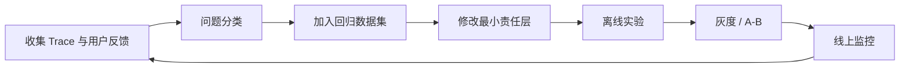

# 13 调试、评测与性能优化

> 本篇提取自原有工程化笔记，补充第 03 章 LangSmith 平台使用之外的测试、评测和性能方法。

## 学习目标

- 区分日志、Tracing、测试和评测
- 能够完整还原一次 Agent Run
- 按模型、Tool、状态和业务层定位问题
- 构造覆盖正常、边界、安全和故障的数据集
- 设计答案、Tool、流程、延迟和成本指标
- 使用离线实验、A/B、灰度和回滚控制上线风险
- 根据测量结果优化 Token、延迟和费用

## 1. 四个概念不要混淆

| 概念 | 解决的问题 | 示例 |
|---|---|---|
| 日志 | 某个组件发生了什么 | Tool 超时、权限拒绝 |
| Tracing | 一次请求经过了哪些步骤 | Model -> Tool -> Model |
| 测试 | 代码是否符合确定性预期 | 非法金额必须被拒绝 |
| 评测 | 模型应用整体效果有多好 | Tool 选择准确率 92% |

它们互相补充：

```text
测试发现确定性回归
评测发现概率性质量变化
Trace 定位具体失败环节
日志还原业务和基础设施细节
```

只看最终答案无法判断：

- 模型是否选错 Tool
- Tool 参数是否错误
- Tool 是否返回过时数据
- 中间件是否提前终止
- 最终回答是否遗漏 Tool 结果

## 2. 一次 Agent Run 应该能够还原什么

### 2.1 请求信息

- `trace_id`、`thread_id`
- 用户、租户和场景标识
- Agent、Prompt 和 Tool 版本
- 模型提供商、模型和主要参数
- 输入长度与 Token

### 2.2 每次模型调用

- 输入消息数量和脱敏摘要
- 可用工具列表
- 模型输出类型
- `tool_calls`
- 输入、输出 Token
- 首 Token 延迟和总耗时
- 结束原因和异常类型

### 2.3 每次工具调用

- Tool 名称和版本
- 脱敏后的标准化参数
- 权限与业务校验结果
- 耗时和重试次数
- 成功、失败或未知状态
- 错误码和结果摘要

### 2.4 Agent 控制信息

- 模型与 Tool 调用次数
- 中间件触发情况
- 是否摘要或裁剪消息
- 是否中断和人工审批
- 最终终止原因

### 2.5 不能记录什么

- API Key、密码和访问令牌
- 未脱敏的身份证、银行卡等 PII
- 完整客户隐私数据
- 模型隐藏思维链
- 不必要的完整文件和网页正文

可以记录简洁的决策结果、证据引用和错误分类，不应依赖暴露隐藏推理来调试。

## 3. 错误分类

推荐先按层分类，再决定修改哪里。

| 层级 | 常见错误 |
|---|---|
| 输入层 | 用户意图不明确、缺少必要参数 |
| Prompt 层 | 目标、约束、边界或格式不清 |
| Model 层 | 能力不足、Tool Calling 不稳定、限流 |
| Structured Output | JSON 非法、字段缺失、Schema 过复杂 |
| Tool 选择 | 漏选、错选、重复调用 |
| Tool 参数 | 类型正确但业务含义错误 |
| Tool 执行 | 超时、权限拒绝、外部服务失败 |
| State / Memory | 丢消息、旧信息污染、线程串线 |
| Middleware | 顺序错误、误重试、提前终止 |
| 业务层 | 幂等、事务、状态和资源归属错误 |
| 输出层 | 未引用证据、遗漏限制、格式不符 |

## 4. 问题定位顺序

```text
1. 固定失败输入、代码版本和模型配置
2. 查看最终状态与终止原因
3. 查看 Trace 中每次模型和 Tool 调用
4. 确认模型看到的消息、工具和上下文
5. 确认 Tool 参数与 Runtime Context
6. 查看 Tool 的稳定结果和底层日志
7. 判断是确定性代码问题还是概率性模型问题
8. 增加最小复现测试
9. 修改最小责任层
10. 跑完整回归集
```

不要一看到回答不好就修改 System Prompt。权限错误应改业务服务，工具超时应改工具或基础设施，知识错误应检查数据源和检索。

## 5. 测试分层

### 5.1 纯函数单元测试

适合：

- Pydantic 校验
- 参数标准化
- 路径边界
- 错误映射
- 幂等 Key 计算
- 数据格式转换

这些测试不调用模型，速度快且结果确定。

### 5.2 Tool Adapter 测试

```text
合法参数 -> 调用 Service 并映射结果
非法参数 -> Schema 拒绝
无权限 -> 稳定 PERMISSION_DENIED
Service 超时 -> 稳定错误协议
未知状态 -> 不直接重试写操作
```

### 5.3 Runnable / Middleware 测试

- Sequence 的输入输出契约
- Parallel 的多个分支
- Branch 的所有路径
- Middleware 顺序
- 调用上限
- 重试错误白名单
- PII 脱敏

### 5.4 Agent 集成测试

使用可控输入检查：

- 是否调用正确 Tool
- Tool 参数是否正确
- ToolMessage 是否完整回传
- 是否在正确条件终止
- 高风险 Tool 是否中断

组件定位测试可以使用 Stub 或 Fake；但模型真实能力必须另有真实 API 测试。

### 5.5 真实模型端到端测试

真实调用验证：

- 当前模型是否支持 Tool Calling
- 兼容平台字段是否一致
- Structured Output 是否稳定
- Prompt 对真实模型是否有效
- Token、延迟和费用是否符合要求

不能用固定假回答证明真实模型能力。

## 6. 评测数据集怎么构造

### 6.1 代表性样本

覆盖真实线上高频意图和主要用户表达方式。

### 6.2 边界样本

- 缺少时间范围
- 同名实体
- 金额临界值
- 空结果
- 上下文冲突
- 多 Tool 都可能适用

### 6.3 失败样本

把线上真实失败脱敏后加入回归集，记录：

- 原始输入
- 失败类型
- 期望行为
- 修复版本
- 是否需要永久回归

### 6.4 安全样本

- 直接和间接提示词注入
- 越权查询
- 跨租户访问
- 重复写操作
- SSRF 和路径穿越
- 敏感信息泄露

### 6.5 故障样本

- 模型超时和限流
- Tool 超时
- Tool 返回非法数据
- 外部服务 5xx
- Checkpoint 恢复
- 写操作结果未知

### 6.6 数据集切分

```text
开发集：日常调试和 Prompt 修改
验证集：选择候选版本
回归集：阻止历史问题复发
盲测集：避免针对固定样本过拟合
线上观察集：评估真实分布变化
```

## 7. 指标体系

### 7.1 最终答案指标

- 事实正确率
- 完整性
- 相关性
- 是否明确不确定性
- 引用和证据一致性
- 输出格式通过率

### 7.2 Tool 指标

- Tool 选择准确率
- 必要 Tool 漏调率
- 不必要 Tool 调用率
- 参数准确率
- Tool 成功率
- 重复调用率
- 高风险操作审批覆盖率

### 7.3 流程指标

- 任务完成率
- 正确终止率
- 循环超限率
- 人工接管率
- 恢复成功率
- 幂等冲突率

### 7.4 性能指标

- 首 Token 延迟
- 总响应时间
- P50 / P95 / P99
- 模型调用次数
- Tool 调用次数
- 输入 / 输出 Token
- 单次请求费用
- 并发吞吐

### 7.5 安全指标

- 注入攻击阻断率
- 越权访问率
- PII 泄露率
- 未审批高风险执行率
- 重复副作用率

单一“答案准确率”无法说明 Agent 是否安全和可上线。

## 8. 确定性评估

能用代码精确判断的，不必先用 LLM Judge：

```python
def evaluate_tool_name(run: dict, expected: str) -> bool:
    return run["tool_calls"][0]["name"] == expected
```

适合代码判断：

- JSON Schema 是否通过
- Tool 名称
- 参数字段和值
- 是否调用禁止 Tool
- 调用次数
- 是否包含必要引用
- 延迟、Token 和费用阈值

确定性指标便宜、快速、可重复，应作为基础防线。

## 9. LLM-as-a-Judge

自然语言质量难以用规则判断时，可以让评审模型评分：

```text
相关性
完整性
语气是否符合产品要求
总结是否忠于证据
```

Judge 的风险：

- 自身会波动
- 可能偏好更长或特定写法
- 可能被待评内容注入
- 不同模型标准不一致
- 会增加费用和延迟

使用原则：

- 给出明确评分 Rubric
- 尽量使用引用证据
- 对关键样本进行人工校准
- 固定 Judge 模型和参数
- 记录 Judge 版本
- 不让 Judge 单独决定高风险上线

## 10. 人工评估

人工评估适合：

- 建立 Gold 标准
- 校准 LLM Judge
- 评估复杂业务正确性
- 审查安全和用户体验
- 分析模型未覆盖的新失败模式

人工标注要定义清晰标准。多个标注者对同一问题理解不同，会让数据集本身不稳定。

## 11. 版本管理

Agent 的效果由多个变量共同决定：

```text
Prompt 版本
模型与参数
Tool Schema 和描述
中间件顺序
知识库版本
代码版本
依赖版本
```

每次实验至少记录这些版本，否则无法解释效果变化来自哪里。

不要同时大幅修改 Prompt、模型、工具和 RAG 数据，再根据结果猜测是哪项变化生效。

## 12. A/B 测试

A/B 测试是让不同用户或请求随机进入候选版本，比较真实线上指标：

```text
版本 A：当前 Prompt
版本 B：候选 Prompt
相同业务入口和指标口径
```

要求：

- 随机且稳定分流
- 用户级场景通常按用户固定版本
- 两组模型参数和其他变量尽量一致
- 样本量达到统计要求
- 预先定义主指标和护栏指标
- 高风险写操作不能只凭在线 A/B 试错

指标示例：

```text
主指标：任务完成率
护栏：越权率必须为 0、P95 延迟不能明显恶化
辅助：Token、人工接管率、用户反馈
```

## 13. 灰度发布

推荐上线顺序：

```text
本地测试
-> 固定数据集离线评测
-> 内部用户
-> 小比例灰度
-> 扩大比例
-> 全量
```

每阶段都要具备：

- 版本标识
- 实时监控
- 自动或人工停止条件
- 快速回滚
- 问题样本收集

生产数据分布与测试数据不同，所以离线通过不等于直接全量上线。

## 14. 性能分析

先拆分耗时：

```text
总耗时 =
  排队时间
  + 模型首 Token 等待
  + 模型生成时间
  + Tool 执行时间
  + 多轮 Agent 循环
  + 序列化和网络传输
```

如果 Tool 查询占 80%，缩短 Prompt 不会显著改善总耗时。必须先通过 Trace 找到主瓶颈。

## 15. Token 优化

按优先级检查：

1. 删除重复、过时和无关消息。
2. 裁剪大型 Tool Result。
3. 长会话使用摘要和结构化 State。
4. Few-shot 只保留代表性和边界示例。
5. RAG 只注入相关片段。
6. 输出 Schema 和字段描述保持清晰、简洁。
7. 限制不必要的长回答。

不能为了省 Token 删除安全约束、关键证据和必要上下文。

## 16. 延迟优化

### 16.1 减少模型轮次

检查是否存在：

- 不必要的规划调用
- 重复结构化转换
- 模型可以一次完成却拆成多次
- Tool 错误不清晰导致模型反复尝试

### 16.2 并行只读操作

无依赖的查询可以并行：

```text
查询天气
查询新闻
查询用户偏好
```

写操作或有依赖步骤不能为了速度盲目并行。

### 16.3 选择合适模型

```text
简单分类、Tool 筛选 -> 小模型
复杂推理和最终总结 -> 更强模型
高风险动作 -> 强模型之外仍需业务控制
```

更大的模型不一定在每个任务上更快或更准确。应以数据集结果选择。

### 16.4 流式体验

流式不能缩短总计算时间，但能降低用户感知的首屏等待。工具执行期间可以展示受控进度，不应展示隐藏推理。

## 17. 缓存

可以缓存：

- 确定性 Prompt + 模型结果
- 不常变化的只读 Tool 结果
- Embedding
- 检索结果
- Prompt 前缀缓存，取决于模型支持

缓存 Key 必须包含影响结果的变量：

```text
模型与版本
Prompt 版本
标准化输入
用户或租户隔离维度
知识版本
工具参数
```

不适合缓存：

- 高实时性数据
- 带用户私密信息但没有隔离的结果
- 写操作结果
- 权限状态频繁变化的查询

缓存要有 TTL、失效策略和命中率监控。

## 18. 成本优化

```text
先减少不必要调用
-> 减少输入 Token
-> 限制输出长度
-> 简单任务使用更小模型
-> 缓存可复用结果
-> 优化检索和 Tool 返回
-> 再考虑批量和供应商价格
```

不要只比较单 Token 价格。模型 Tool 选择不稳定导致多调用，最终可能比更贵但一次完成的模型成本更高。

## 19. 生产监控与告警

至少监控：

- 请求量、成功率和错误率
- P50/P95/P99 延迟
- 模型与 Tool 调用次数
- Token 和费用
- Tool 错误码分布
- 循环超限和重试率
- Structured Output 失败率
- 人工审批和接管率
- 安全阻断事件

告警应关联版本发布。新 Prompt 上线后错误率上升，需要能迅速定位到该版本并回滚。

## 20. 优化闭环



一次修复必须留下：

- 可复现样本
- 失败分类
- 修复内容
- 自动化测试或评测
- 上线指标
- 回滚条件

## 21. 自测

1. 日志、Trace、测试和评测分别解决什么问题？
2. 为什么回答错误时不应该第一反应就改 Prompt？
3. Tool 选择准确率和最终答案准确率为什么要分别统计？
4. 哪些指标适合代码评估，哪些需要 Judge 或人工？
5. A/B 测试为什么需要护栏指标？
6. 如何判断应该优化 Prompt Token 还是 Tool 延迟？
7. 为什么缓存 Key 必须包含用户或租户维度？

## 总结

```text
日志：组件事实
Trace：完整调用链
测试：确定性行为
评测：概率性整体效果
数据集：代表、边界、失败、安全和故障样本
指标：答案、Tool、流程、安全、延迟和成本
A/B 与灰度：控制线上发布风险
性能优化：先测量瓶颈，再减少轮次、Token 和慢 Tool
```

Agent 工程化的核心不是让一次演示成功，而是能够解释失败、阻止回归，并用数据持续改善质量、延迟和成本。
