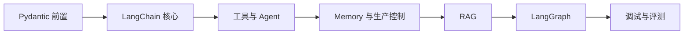

# Agent 开发实战学习路径

## 1. 阶段目标

这一阶段承接已经完成的 Agent 原生机制学习，开始使用主流框架开发一个具备以下能力的生产级单 Agent：

- 使用 LangChain 组合模型、提示词、结构化输出和工具
- 接入搜索、数据库、文件和 HTTP API 等真实工具
- 管理会话上下文与短期记忆
- 使用 RAG 检索外部知识
- 使用 LangGraph 表达分支、循环、恢复和人工确认
- 具备权限、幂等、错误处理、日志、测试和评测能力

本阶段不学习多 Agent。Supervisor、Swarm、AutoGPT、MetaGPT、Agent 间通信与协作协议等内容，放到后续独立的多 Agent 学习阶段。

## 2. 学习形式

每一课原则上包含两部分：

```text
notes/Agent开发实战/XX-课程名称.md
practice/XX-英文练习目录/
```

学习材料要求：

- Markdown 笔记使用中文，解释概念、原理、数据流和生产边界
- 配套代码使用 Python 3.11，并纳入当前 `uv workspace`
- 每个练习包含 `.env.example`、`README.md`、`pyproject.toml`、`src/` 和测试
- 涉及模型能力时提供真实 API 端到端测试，不使用假回答代替真实验证
- 单元测试可以保留，用于端到端失败后定位具体模块
- 每完成一课，更新本 README 的状态和实际文件链接

## 3. 总体顺序



## 4. 课程清单

### 第一部分：前置知识与 LangChain 核心

#### [x] 00 Pydantic 基础

- 笔记：[00-Pydantic基础.md](00-Pydantic基础.md)
- 实践：合并到 `practice/05-langchain-basics`
- 内容：`BaseModel`、`Field`、数据校验、序列化、错误处理、LangChain 结构化输出
- 目标：能够看懂并编写大模型结构化输入输出 Schema

#### [x] 01 LangChain 基础

- 笔记：[01-LangChain基础.md](01-LangChain基础.md)
- 实践：[practice/05-langchain-basics](../../practice/05-langchain-basics/README.md)
- 内容：ChatModel、Messages、Prompt Template、基础 Runnable、Structured Output
- 目标：理解 LangChain 如何封装原生模型调用，以及数据如何在组件间流动

#### [x] 02 Runnable 与 LCEL 深入

- 笔记：[02-Runnable与LCEL深入.md](02-Runnable与LCEL深入.md)
- 实践：[practice/06-langchain-runnables](../../practice/06-langchain-runnables/README.md)
- 内容：`RunnableSequence`、`RunnableLambda`、`RunnablePassthrough`、并行、分支、透传、批量、流式、异步、重试和 fallback
- 目标：能够使用 LCEL 构建可组合、可测试的多步骤处理链

### 第二部分：工具与 LangChain Agent

#### [x] 03 LangChain Tools

- 笔记：[03-LangChainTools.md](03-LangChainTools.md)
- 实践：[practice/07-langchain-tools](../../practice/07-langchain-tools/README.md)
- 内容：`@tool`、工具参数 Schema、`bind_tools()`、`ToolMessage`、工具执行器和错误结果
- 目标：把已经掌握的原生 Tool Calling 映射到 LangChain 工具抽象

#### [x] 04 LangChain Agent

- 笔记：[04-LangChainAgent.md](04-LangChainAgent.md)
- 实践：[practice/08-langchain-agent](../../practice/08-langchain-agent/README.md)
- 内容：`create_agent`、Agent 执行循环、系统提示词、工具选择、结构化响应和终止条件
- 目标：使用 LangChain 构建能够自主选择并调用工具的单 Agent

#### [x] 05 上下文与 Memory

- 笔记：[05-上下文与Memory.md](05-上下文与Memory.md)
- 实践：[practice/09-langchain-memory](../../practice/09-langchain-memory/README.md)
- 内容：短期记忆、会话隔离、上下文窗口、消息裁剪、历史摘要和 Checkpointer 基础
- 目标：让 Agent 在多轮对话中保持连续状态，同时控制 token 消耗

#### [x] 06 生产级工具集成

- 笔记：[06-生产级工具集成.md](06-生产级工具集成.md)
- 实践：[practice/10-production-tools](../../practice/10-production-tools/README.md)
- 内容：搜索工具、SQL 查询、文件操作、HTTP API 和自定义业务工具
- 目标：掌握图中要求的主要工具类型，并建立统一工具返回协议

#### [x] 07 Agent 安全与中间件

- 笔记：[07-Agent安全与中间件.md](07-Agent安全与中间件.md)
- 实践：[practice/11-agent-middleware](../../practice/11-agent-middleware/README.md)
- 内容：动态 System Prompt、调用前后钩子、权限、幂等、超时重试、调用上限、敏感信息处理和人工确认
- 目标：明确大模型、Agent 编排层和业务服务各自负责的安全边界

提示词优化不会在这里重新讲一遍完整理论。已经学习过的 System Prompt、Few-shot、输出格式和错误处理 Prompt，会在 04、06、07 课中直接应用。

### 第三部分：RAG

#### [x] 08 文档加载与切分

- 笔记：[08-文档加载与切分.md](08-文档加载与切分.md)
- 实践：[practice/12-document-processing](../../practice/12-document-processing/README.md)
- 内容：Document、Metadata、文档加载器、文本清洗、固定长度切分和语义切分
- 目标：把原始文件转换为适合检索的标准文档块

#### [x] 09 Embedding 与向量存储

- 笔记：[09-Embedding与向量存储.md](09-Embedding与向量存储.md)
- 实践：[practice/13-vector-store](../../practice/13-vector-store/README.md)
- 内容：Embedding、向量相似度、向量数据库、Metadata 过滤、写入和更新策略
- 目标：建立一个可重复构建和更新的本地知识库

#### [x] 10 Retriever 与标准 RAG

- 笔记：[10-Retriever与标准RAG.md](10-Retriever与标准RAG.md)
- 实践：[practice/14-rag-chain](../../practice/14-rag-chain/README.md)
- 内容：Retriever、Top-K、相似度阈值、查询改写、重排、引用来源、无答案拒答和 RAG Chain
- 目标：完成一个回答可追溯、无知识时不编造的标准 RAG 应用

#### [x] 11 Agentic RAG

- 笔记：[11-AgenticRAG.md](11-AgenticRAG.md)
- 实践：[practice/15-agentic-rag](../../practice/15-agentic-rag/README.md)
- 内容：Agent 判断是否检索、选择知识库、改写问题、检查检索质量和再次检索
- 目标：把 RAG 作为 Agent 的受控能力，而不是每个问题都固定检索

### 第四部分：LangGraph 单 Agent 工作流

#### [x] 12 LangGraph 基础

- 笔记：[12-LangGraph基础.md](12-LangGraph基础.md)
- 实践：[practice/16-langgraph-basics](../../practice/16-langgraph-basics/README.md)
- 内容：State、Node、Edge、条件边、编译和执行
- 目标：理解 LangChain Agent 底层的图工作流表达方式

#### [x] 13 LangGraph 进阶流程

- 笔记：[13-LangGraph进阶流程.md](13-LangGraph进阶流程.md)
- 实践：[practice/17-langgraph-workflow](../../practice/17-langgraph-workflow/README.md)
- 内容：循环、并行、路由、子图、错误分支和失败恢复
- 目标：将复杂任务从线性 Chain 改造成状态明确、路径可控的工作流

#### [x] 14 持久化与人工介入

- 笔记：[14-持久化与人工介入.md](14-持久化与人工介入.md)
- 实践：[practice/18-langgraph-persistence](../../practice/18-langgraph-persistence/README.md)
- 内容：Checkpoint、线程状态、暂停和恢复、Human-in-the-loop、危险操作审批
- 目标：构建能够中断、确认、恢复执行的生产级单 Agent 流程

LangGraph 在本阶段只用于单 Agent 的状态和工作流控制，不扩展到多 Agent 协作。

### 第五部分：工程化与评测

#### [x] 15 调试、评测与性能优化

- 笔记：[15-调试评测与性能优化.md](15-调试评测与性能优化.md)
- 实践：[practice/19-agent-evaluation](../../practice/19-agent-evaluation/README.md)
- 内容：结构化日志、LangSmith Trace、中间步骤可视化、错误分类、测试集、准确率、延迟、token 和费用
- 目标：能够解释 Agent 为什么失败，并通过数据而不是感觉优化效果

## 5. 阶段边界

完成第 15 课以后，再单独规划后续主题：

- 多 Agent 架构与适用条件
- Supervisor、Router、Swarm 等协作模式
- Agent 间任务、上下文和权限隔离
- AutoGPT、MetaGPT 等框架的设计比较
- 多 Agent 的通信、死循环、成本和评测

这些内容不会提前混入当前单 Agent 学习路径。

## 6. 当前进度

```text
已完成：00 Pydantic 基础
已完成：01 LangChain 基础
已完成：02 Runnable 与 LCEL 深入
当前阶段已完成：00-15
```
