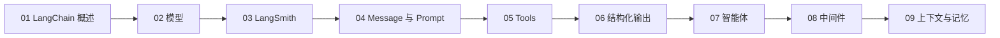

# Agent 开发实战学习路径

## 1. 整理说明

本目录按照 `D:\WorkSpace\01-课件` 中尚硅谷 01-09 课件重新整理。笔记不是逐页抄写，而是保留概念、关键 API、执行流程、代码骨架和生产边界，去掉平台注册、充值步骤、超长运行输出和固定密钥等低价值内容。

```text
01 LangChain 概述
02 模型的创建与调用
03 LangSmith 的使用
04 Message 与提示词模板
05 Tools
06 结构化输出
07 智能体
08 中间件
09 上下文与记忆
```

示例以课件内容为基础，并按照当前项目的 LangChain 1.3、LangChain Core 1.4 和 LangGraph 1.2 接口校正。模型提供商、模型名称和扩展参数仍应以实际服务文档为准。

## 2. 学习目标

完成本阶段后，应能够：

- 创建和调用不同提供商的 ChatModel
- 使用 Message 与 Prompt Template 组织模型输入
- 把 Python 函数封装为 Tool，并理解 Tool Calling 完整循环
- 使用 Pydantic 等 Schema 获取结构化输出
- 使用 `create_agent()` 构建可调用工具的单 Agent
- 使用中间件增加摘要、人工审批、调用限制、重试和敏感信息处理
- 使用 Checkpointer、Store 和 Runtime Context 管理上下文与记忆
- 使用 LangSmith 跟踪、评估和调试模型应用

## 3. 学习顺序


```mermaid
flowchart LR
    Z["01 LangChain 概述"] --> A["02 模型"]
    A --> B["03 LangSmith"]
    B --> C["04 Message 与 Prompt"]
    C --> D["05 Tools"]
    D --> E["06 结构化输出"]
    E --> F["07 智能体"]
    F --> G["08 中间件"]
    G --> H["09 上下文与记忆"]
```

03 LangSmith 也可以在完成 07 Agent 后复习。把它放在前面，是为了从第一段模型代码开始就建立 Trace 意识。

## 4. 课程目录

### [01 LangChain 概述](01-LangChain概述.md)

- 来源：`尚硅谷-01-LangChain概述.pdf`
- 内容：框架定位、1.x 包结构、生态关系、开发环境以及 Prompt、Agent、RAG、微调的技术选型
- 目标：建立 LangChain 全局认识，明确本阶段范围和学习顺序

### [02 模型的创建与调用](02-模型的创建与调用.md)

- 来源：`尚硅谷-02-模型的创建与调用.pdf`
- 内容：模型初始化、在线/本地模型、配置管理、`invoke`、`stream`、`batch`、异步调用、`AIMessage`、模型参数和 Runnable Config
- 目标：建立统一的 ChatModel 调用入口

### [03 LangSmith 的使用](03-LangSmith的使用.md)

- 来源：`尚硅谷-03-LangSmith的使用.pdf`
- 内容：Tracing、Dataset、Experiment、Evaluator、人工标注和生产可观测性
- 目标：能定位一次 LLM 调用经过了什么、为何失败、耗时和成本是多少

### [04 Message 与提示词模板](04-Message与提示词模板.md)

- 来源：`尚硅谷-04-Message与提示词模板.pdf`
- 内容：消息类型、消息内容块、`ChatPromptTemplate`、`MessagesPlaceholder`、变量、Partial 和模板组合
- 目标：用结构化消息和模板可靠组织模型上下文

### [05 Tools](05-Tools.md)

- 来源：`尚硅谷-05-Tools.pdf`
- 内容：`@tool`、工具描述、参数 Schema、`bind_tools()`、`AIMessage.tool_calls`、`ToolMessage`、多工具和 `tool_choice`
- 目标：理解模型提出工具调用、应用执行并回传结果的完整链路

### [06 结构化输出](06-结构化输出.md)

- 来源：`尚硅谷-06-结构化输出.pdf`
- 内容：Pydantic、TypedDict、JSON Schema、dataclass、`with_structured_output()`、`method`、`include_raw` 和 Output Parser
- 目标：把模型自然语言结果转换为可校验的业务数据

### [07 智能体](07-智能体.md)

- 来源：`尚硅谷-07-智能体.pdf`
- 内容：Agent 组成、`create_agent()`、工具循环、System Prompt、Agent 名称、结构化响应策略和流式模式
- 目标：构建能够根据工具结果持续决定下一步的单 Agent

### [08 中间件](08-中间件.md)

- 来源：`尚硅谷-08-中间件.pdf`
- 内容：摘要、人工审核、PII、Todo、调用上限、Fallback、工具筛选、重试、上下文清理、文件/Shell 能力、自定义 Hook 和执行顺序
- 目标：为 Agent 增加可观察、可限制、可中断和可恢复的工程控制

### [09 上下文与记忆](09-上下文与记忆.md)

- 来源：`尚硅谷-09-上下文与记忆.pdf`
- 内容：State、Checkpointer、`thread_id`、消息治理、`RemoveMessage`、长期 Store、语义检索、ToolRuntime 和 Runtime Context
- 目标：正确管理线程内状态、跨线程记忆和可信运行信息

## 5. 课件外补充篇

以下内容来自原有学习笔记中课件 01-09 没有完整覆盖的部分，已经按当前版本重新整理。它们不是旧笔记的原样恢复。

### [00 Pydantic 前置知识](00-Pydantic前置知识.md)

- 建议位置：第 06 章结构化输出之前
- 内容：运行时校验、`Field`、嵌套模型、严格模式、序列化、自定义校验器和模型分层
- 保留原因：课件直接使用 Pydantic，但没有系统讲其基础和业务边界

### [10 Runnable 与 LCEL 深入](10-Runnable与LCEL深入.md)

- 建议位置：第 04 章 Message 与提示词模板之后
- 内容：Sequence、Lambda、Parallel、Passthrough、Assign、Branch、Batch、Async、Stream、Retry 和 Fallback
- 保留原因：Runnable 是 LangChain 的统一组合协议，课件只在示例中使用，没有完整展开

### [11 生产级工具集成](11-生产级工具集成.md)

- 建议位置：第 05 章 Tools 之后
- 内容：Tool Adapter、参数/权限/业务三层校验、SQL、文件、HTTP、未知状态和稳定错误协议
- 保留原因：课件重点是 Tool Calling，未完整覆盖真实后端集成风险

### [12 Agent 安全与业务边界](12-Agent安全与业务边界.md)

- 建议位置：第 08 章中间件之后
- 内容：信任边界、直接/间接提示词注入、Tool Allowlist、租户隔离、幂等、人工审批、SSRF、文件和 Shell 安全
- 保留原因：Middleware 是控制入口，但生产安全最终需要业务服务和基础设施共同保证

### [13 调试、评测与性能优化](13-调试评测与性能优化.md)

- 建议位置：第 09 章完成之后
- 内容：测试分层、评测集、答案/Tool/流程/安全指标、LLM Judge、A/B、灰度、Token、延迟和成本优化
- 保留原因：LangSmith 课件讲平台能力，本篇补充完整工程闭环

推荐学习插入顺序：

```text
01 -> 02 -> 03 -> 04
-> 10 Runnable 与 LCEL
-> 05 Tools
-> 11 生产级工具集成
-> 00 Pydantic 前置
-> 06 -> 07 -> 08
-> 12 Agent 安全与业务边界
-> 09
-> 13 调试、评测与性能优化
```

## 6. 学习方式

每一课建议按下面顺序学习：

```text
阅读笔记，建立概念和数据流
-> 手动运行最小示例
-> 阅读对应 practice 的串联测试
-> 使用真实模型执行端到端场景
-> 修改输入观察 Trace、消息和状态变化
-> 补充失败、边界与生产控制测试
```

不要只看最终回答。学习 Agent 时应同时观察：

- 发送给模型的消息
- 模型返回的 `tool_calls`
- 工具的真实输入和输出
- Agent State 的变化
- 中间件触发顺序
- Trace 中的耗时、Token 和错误

## 7. 与 Practice 的关系

当前阶段先完成笔记重建，`practice/Agent开发实战` 尚未按 01-09 课件重新整理。因此旧实践目录中的 README 链接和编号可能暂时与本目录不一致。

下一阶段再处理实践代码，原则是：

- 每份课件至少有一个可运行的串联 Case
- 示例使用 Python 3.11 和当前 `uv workspace`
- 模型能力使用真实 API 端到端验证
- 单元测试用于定位组件问题，不代替完整流程测试
- 不把 API Key 写入源码、笔记或 Git

## 8. 阶段边界

本目录聚焦 LangChain 单 Agent 基础和工程控制，不展开：

- RAG：已拆分到 [RAG 开发实战](../RAG开发实战/README.md)
- 多 Agent：后续独立规划
- MCP：后续独立学习

## 9. 当前进度

```text
笔记：01-09 已按 PDF 重建
补充：00、10-13 已从旧笔记独有内容重新整理
Practice：待按新笔记结构重新整理
RAG：独立学习路径
LangGraph、多 Agent：未纳入本阶段
```
