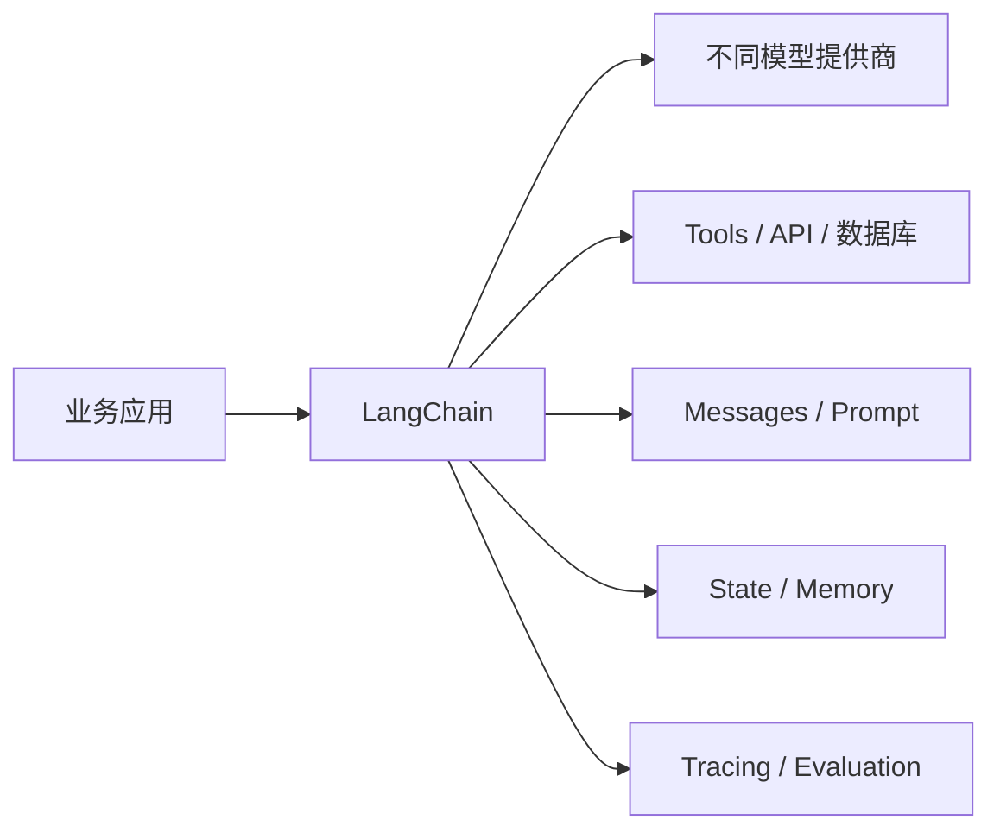
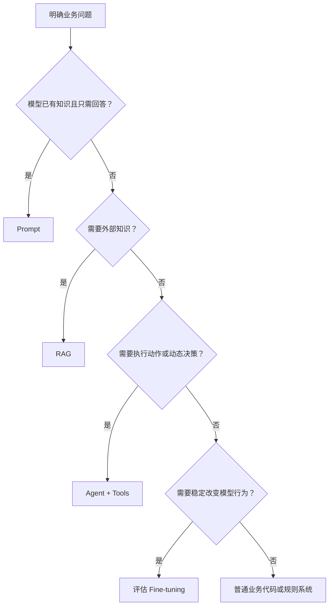

# 01 LangChain 概述

> 来源：`尚硅谷-01-LangChain概述.pdf`。课件使用 LangChain 1.2，本项目使用 LangChain 1.3，学习时以当前项目实际接口为准。

## 学习目标

- 理解为什么大模型应用需要 LangChain
- 明确 LangChain 解决什么问题、不解决什么问题
- 了解 LangChain 1.x 的核心包与生态定位
- 区分 Prompt、Agent、RAG 和微调的适用场景
- 确认本项目的学习范围与开发环境

## 1. 为什么需要 LangChain

### 1.1 从模型调用到应用开发

最简单的大模型程序只有一次请求：

```text
用户输入 -> 大模型 -> 文本回答
```

真实应用通常还需要：

```text
提示词模板
消息历史
结构化输出
工具调用
外部知识检索
状态与记忆
人工审批
日志、评测和故障定位
```

如果直接使用每家模型提供商的 SDK，这些能力都要自行组织，而且更换提供商时接口和返回结构可能变化。

LangChain 位于模型和业务应用之间，提供统一抽象：



### 1.2 单一大模型的局限

只调用模型无法可靠解决所有问题：

| 局限 | 具体表现 | 常见补充能力 |
|---|---|---|
| 知识有截止时间 | 不知道刚发生的新闻或实时库存 | 搜索、API、RAG |
| 不了解私有数据 | 不知道企业文档和用户订单 | RAG、数据库 Tool |
| 不能直接执行业务 | 只能生成“应该退款”的文字 | Tool Calling |
| 输出不稳定 | JSON 字段缺失或类型错误 | Structured Output |
| 请求间没有记忆 | 下一次调用不知道上一轮内容 | Checkpointer、Store |
| 推理过程不可观察 | 失败时难以定位环节 | LangSmith、日志 |

LangChain 不会让模型自动变得更聪明。它提供组件和执行框架，把模型与外部能力组织成可开发、可观察的应用。

## 2. LangChain 的定位

LangChain 是面向大模型应用和 Agent 的开发框架，主要价值可以概括为三点。

### 2.1 统一模型与组件接口

不同模型通过统一的 ChatModel 接口调用：

```python
response = model.invoke(messages)
```

Prompt、Model、Parser、Retriever 和 Tool 等组件可以使用一致的 Runnable 调用方式：

```text
invoke / ainvoke
stream / astream
batch / abatch
```

统一接口降低切换成本，但不会消除不同提供商之间的能力差异。

### 2.2 连接外部资源

LangChain 可以把模型与以下能力连接起来：

- 搜索引擎
- 企业知识库
- 数据库
- HTTP API
- 文件系统
- 业务服务

模型负责表达调用意图，应用程序负责校验和真正执行。

### 2.3 封装 Agent 执行循环

```text
调用模型
-> 判断是否产生 Tool Call
-> 执行工具
-> 把 ToolMessage 放回状态
-> 再次调用模型
-> 直到最终回答或达到限制
```

LangChain 负责通用循环和状态编排，业务代码仍负责权限、幂等、事务和风险控制。

## 3. 典型应用场景

### 3.1 RAG

适合模型缺少私有、专业或最新知识的场景：

```text
用户问题
-> 检索相关文档
-> 把文档作为上下文交给模型
-> 根据文档生成回答
```

典型应用：企业知识问答、智能客服、规章制度查询、产品文档助手。

### 3.2 Agent

适合需要根据过程结果决定下一步，并调用外部工具的任务：

```text
查询订单
-> 判断订单状态
-> 必要时请求人工确认
-> 执行退款
-> 查询最终状态
```

Agent 适合动态流程，不代表所有任务都应使用 Agent。步骤固定、规则明确的流程通常更适合普通业务代码。

### 3.3 对话系统

结合 Messages、Prompt、Checkpointer 和 Store，实现多轮客服、学习助手和业务问答。

### 3.4 多模态应用

支持能够接收图片、音频、文档等内容块的模型，统一组织多模态消息。是否可用取决于实际模型能力。

### 3.5 结构化数据处理

让模型完成分类、抽取、格式转换和摘要，并通过 Pydantic 或 JSON Schema 约束输出。

## 4. LangChain 的发展与 1.x 变化

LangChain 于 2022 年开始发展。早期版本以 Chain 和大量独立 Agent API 为主，功能丰富但变化频繁。

LangChain 1.x 的主要方向是：

- 收敛核心 Agent API
- 使用统一的 `create_agent()`
- 强化 Middleware、Structured Output 和 Runtime Context
- 把旧版接口移入 `langchain-classic`
- 把第三方提供商拆分为独立集成包
- 让状态、持久化和流式执行拥有统一基础

学习旧教程时要先确认版本。下面这些旧 API 不应直接照搬到当前项目：

```text
AgentExecutor
create_react_agent（旧 LangChain Agent 入口）
ConversationBufferMemory 等 0.x Memory 类
大量 langchain.chains 下的经典 Chain
```

当前课程优先使用：

```text
init_chat_model
ChatPromptTemplate
Runnable / LCEL
@tool
with_structured_output
create_agent
Middleware
Checkpointer / Store
```

## 5. LangChain 1.x 的包结构

### 5.1 `langchain`

提供高层 Agent API、中间件和统一模型初始化等主要入口：

```python
from langchain.agents import create_agent
from langchain.chat_models import init_chat_model
```

### 5.2 `langchain-core`

提供底层通用协议和数据类型：

```text
Runnable
BaseMessage / HumanMessage / AIMessage / ToolMessage
ChatPromptTemplate
BaseTool
OutputParser
```

```python
from langchain_core.messages import HumanMessage
from langchain_core.prompts import ChatPromptTemplate
from langchain_core.tools import tool
```

### 5.3 提供商集成包

不同模型和外部服务通常使用独立包，避免主包包含全部依赖：

```text
langchain-openai
langchain-anthropic
langchain-ollama
langchain-community
```

其中 `langchain-community` 包含大量社区维护的加载器、工具和集成。生产接入前要核对维护状态、权限和依赖安全。

### 5.4 `langchain-classic`

用于承载旧版经典接口和兼容代码。新项目不应因为旧教程而默认选择它；只有明确需要迁移旧系统时再使用。

## 6. LangChain 生态

### 6.1 LangChain

负责模型、Message、Prompt、Tool、Structured Output 和 Agent 等能力抽象，是本阶段的学习重点。

### 6.2 LangSmith

负责 Trace、调试、数据集、实验和评测。第 03 章单独学习。

### 6.3 Deep Agents

在基础 Agent 上提供更强的任务规划、文件系统、子任务等能力。它不是当前阶段的必学内容。

### 6.4 LangGraph

LangChain Agent 的运行时能力与 LangGraph 有关联，但本学习路线不单独展开 LangGraph。相关内容已经整理到 [LangGraph 开发实战](../LangGraph开发实战/README.md)。

## 7. 开发前置知识

### 7.1 Python

至少需要掌握：

- 函数、类和模块
- 类型标注
- 字典、列表和推导式
- 装饰器
- 异常处理
- `async` / `await` 基础
- 环境变量

Pydantic、TypedDict、Protocol 和 Annotated 会在实际使用处补充。

### 7.2 大模型基础

需要理解：

- Token 与上下文窗口
- System、User、Assistant 消息
- Temperature 等采样参数
- 提示词与 Few-shot
- Tool Calling
- Embedding 与向量检索的基本概念

## 8. 当前项目环境

本项目已经使用 Python 3.11 和 `uv workspace`，不需要重新按课件创建 Conda 环境。

同步全部工作区依赖：

```bash
uv sync --all-packages --no-editable
```

查看当前版本：

```bash
uv run python -c "from importlib.metadata import version; print(version('langchain'))"
```

项目当前核心版本：

```text
langchain 1.3.x
langchain-core 1.4.x
langgraph 1.2.x（作为底层依赖，不单独学习）
Python 3.11
```

API Key 和 Base URL 放入 `.env`，不能写入 Python、Markdown、日志或 Git。

## 9. 四种大模型应用方案

### 9.1 纯 Prompt

```text
用户输入 -> Prompt -> Model -> 回答
```

适合：模型已有知识、无实时数据、无外部操作、流程简单。

### 9.2 Agent + Tool Calling

```text
用户目标 -> Agent -> Tool -> Observation -> Agent -> 回答
```

适合：需要调用 API、数据库或业务服务，并根据结果动态决定下一步。

### 9.3 RAG

```text
问题 -> 检索外部知识 -> 注入上下文 -> 模型回答
```

适合：需要企业知识、专业文档或经常变化的知识。RAG 提供知识，不直接负责执行业务动作。

### 9.4 Fine-tuning

通过训练数据改变模型稳定行为或特定能力。成本和维护复杂度通常高于 Prompt 和 RAG。

微调不适合保存频繁变化的事实。最新产品价格、政策和企业文档通常更适合 RAG 或 Tool。

## 10. 技术选型顺序



实际系统可以组合使用，例如 Agent 调用 RAG Retriever，再调用业务 Tool。但应从最简单、最可控的方案开始。

## 11. 本学习路线

```text
01 LangChain 概述
02 模型的创建与调用
03 LangSmith 的使用
04 Message 与提示词模板
05 Tools
06 结构化输出
07 智能体
08 中间件
09 上下文与记忆
```

本阶段不包含 LangGraph 和多 Agent。LangGraph 与 RAG 均已拆分为独立学习目录。

## 总结

```text
LangChain：连接模型、消息、Prompt、Tool、状态和业务应用
langchain-core：通用协议与基础类型
集成包：连接具体模型和外部服务
LangSmith：追踪、调试和评测
Prompt：简单生成任务
RAG：补充外部知识
Agent：调用工具并动态决定下一步
Fine-tuning：改变模型稳定行为，成本最高
```

LangChain 的价值是统一组件和执行方式，不是替代业务代码，也不是让模型自动获得事实、权限和安全性。
