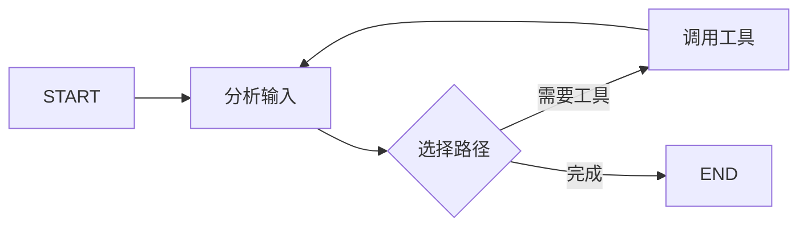

# 1. LangGraph 总览

## 1.1 LangGraph 解决什么问题

普通的 LangChain 链适合固定的线性流程；当应用需要循环、条件分支、并行、持久化、人工审批和失败恢复时，单纯串联 Runnable 会越来越难维护。

LangGraph 把应用表示成一张**有状态的执行图**：

- 节点负责计算或副作用。
- 边决定下一步执行哪个节点。
- State 在节点之间传递数据。
- Checkpointer 保存执行进度，使任务可以暂停和恢复。

典型场景包括 Agent 工具循环、审批工作流、长耗时任务、多阶段内容生成和可恢复的数据处理流程。

> LangChain 提供模型、提示词、Tool 和 Agent 等高层组件；LangGraph 提供底层的状态编排与运行时。二者不是替代关系。

## 1.2 核心组成

| 组成 | 作用 | 常见形式 |
| --- | --- | --- |
| State | 图运行期间共享的数据 | `TypedDict`、dataclass、Pydantic |
| Node | 读取 State 并返回状态更新 | Python 函数、Runnable、子图 |
| Edge | 描述节点之间的控制流 | 普通边、条件边、`Command`、`Send` |
| START | 图的虚拟入口 | `builder.add_edge(START, "node")` |
| END | 图的虚拟出口 | 条件路由返回 `END` |
| Checkpointer | 保存线程内状态和执行位置 | InMemory、SQLite、PostgreSQL |
| Store | 保存跨线程的长期数据 | InMemory、PostgreSQL 等 |

最重要的心智模型是：

```text
当前 State
  -> 根据边选择本轮可执行节点
  -> 节点读取同一份本轮快照并产生更新
  -> Reducer 合并更新
  -> 形成下一轮 State
  -> 继续执行或到达 END
```

LangGraph 以“超步”组织执行。一个超步内可以运行多个互不依赖的节点；这些节点完成后，结果统一合并，再进入下一超步。这解释了为什么并行节点需要 Reducer，也解释了检查点通常出现在超步边界。



## 1.3 Graph API 与 Functional API

### Graph API

显式创建 `StateGraph`，再添加节点和边。

优点：

- 图结构清晰，适合分支、循环和并行。
- 可以为节点单独配置重试、缓存、超时等策略。
- 便于可视化、调试和复用子图。

```python
from langgraph.graph import END, START, StateGraph

builder = StateGraph(State)
builder.add_node("prepare", prepare)
builder.add_node("answer", answer)
builder.add_edge(START, "prepare")
builder.add_edge("prepare", "answer")
builder.add_edge("answer", END)
graph = builder.compile()
```

### Functional API

使用 `@entrypoint` 和 `@task` 把普通函数组织成可持久化任务，控制流仍由 Python 的 `if`、`for`、函数调用表达。

优点：

- 改造现有 Python 流程的成本低。
- 线性流程和少量分支更直观。
- 不必手工声明每一条边。

局限：复杂路由、循环和图结构分析不如 Graph API 直观。

### 选型

| 场景 | 建议 |
| --- | --- |
| Agent 循环、复杂分支、并行编排 | Graph API |
| 已有 Python 工作流需要增加持久化 | Functional API |
| 团队需要图可视化和节点级治理 | Graph API |
| 流程短且主要依赖普通 Python 控制流 | Functional API |

本学习路径以 Graph API 为主，因为它能完整展示 LangGraph 的 State、Reducer、控制流和持久化机制。

## 1.4 什么时候不需要 LangGraph

以下场景通常不必引入图：

- 只有一次模型调用。
- 固定的 Prompt -> Model -> Parser 流程。
- 没有分支、循环、状态恢复或人工审批。
- 普通业务代码已经能清晰表达流程。

LangGraph 的价值是管理复杂状态和执行流程，不是让简单调用看起来更“Agent”。

## 1.5 学习主线

```text
构建基础图
-> 理解 State 和 Reducer
-> 掌握分支、并行、循环
-> 增加重试、缓存和错误处理
-> 使用 Checkpointer 与 Store
-> 实现中断、流式输出、ToolNode 和子图
-> 组合为常见运行图设计模式
```
