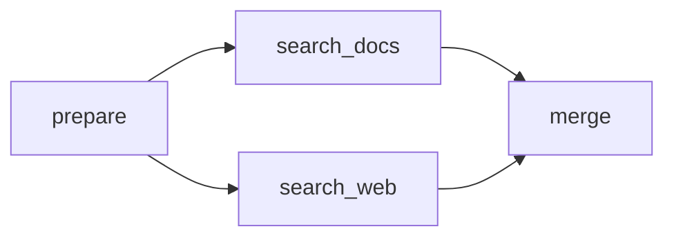

# 4. 控制流

LangGraph 的控制流包括顺序、分支、并行汇聚和循环。固定拓扑优先使用边；需要同时更新 State 和选择目标时使用 `Command`；需要动态创建多个任务时使用 `Send`。

## 4.1 顺序结构

### add_edge

```python
builder.add_edge(START, "load")
builder.add_edge("load", "process")
builder.add_edge("process", END)
```

### add_sequence

连续节点可以简写为：

```python
builder.add_sequence([load, process, save])
builder.add_edge(START, "load")
builder.add_edge("save", END)
```

也可以传入 `(name, callable)` 元组显式指定节点名称。

`END` 能明确表达结束位置。最后一个节点没有后续任务时图也会结束，但生产图建议显式连接 `END`，方便阅读和可视化。

## 4.2 静态分支与并行

从同一节点添加多条普通边，会在下一超步并行调度多个节点：

```python
builder.add_edge("prepare", "search_docs")
builder.add_edge("prepare", "search_web")
```

两个节点读取的是同一份超步快照，不会看到对方尚未合并的更新。如果它们更新同一 State 字段，该字段需要合适的 Reducer。



## 4.3 条件边

`add_conditional_edges()` 根据路由函数返回值选择目标：

```python
from typing import Literal


def route(state: State) -> Literal["search", "answer"]:
    return "search" if state["need_search"] else "answer"


builder.add_conditional_edges(
    "classify",
    route,
    {
        "search": "search",
        "answer": "answer",
    },
)
```

如果路由函数直接返回真实节点名或 `END`，可以省略 `path_map`：

```python
def route(state: State):
    return "search" if state["need_search"] else END


builder.add_conditional_edges("classify", route)
```

路由函数应该是确定性的纯判断，不要在里面执行数据库写入或远程调用。需要计算时先放入普通节点，再根据计算结果路由。

## 4.4 Command：更新状态并路由

节点既要更新 State 又要决定下一节点时，可以返回 `Command`：

```python
from typing import Literal
from langgraph.types import Command


def review(state: State) -> Command[Literal["publish", "revise"]]:
    if state["score"] >= 0.8:
        return Command(update={"approved": True}, goto="publish")
    return Command(update={"approved": False}, goto="revise")
```

`Command` 常用字段：

| 字段 | 作用 |
| --- | --- |
| `update` | 写入 State 更新 |
| `goto` | 指定后续节点，也可以是 `Send` 或列表 |
| `resume` | 恢复 `interrupt()` |
| `graph` | 路由到父图等其他图层级 |

`Command` 的 `goto` 会增加动态目标，但不会自动删除已声明的普通边。不要同时声明冲突的固定边和动态路由。

返回类型中的 `Literal` 既提供类型提示，也帮助 LangGraph 可视化潜在目标。

## 4.5 Fan-in：等待多分支汇聚

当汇聚节点必须等待多个前置节点完成，可以把起点写成列表：

```python
builder.add_edge(["search_docs", "search_web"], "merge")
```

这表示 `merge` 在两个节点都完成后执行。它与下面写法语义不同：

```python
builder.add_edge("search_docs", "merge")
builder.add_edge("search_web", "merge")
```

后者可能让 `merge` 被两个分支分别触发。需要同步屏障时使用列表形式。

## 4.6 Send：动态 Map-Reduce

当任务数量运行时才知道，例如把多个文档并行摘要，可以从条件路由返回多个 `Send`：

```python
import operator
from typing import Annotated, TypedDict

from langgraph.types import Send


class OverallState(TypedDict):
    documents: list[str]
    summaries: Annotated[list[str], operator.add]


class WorkerState(TypedDict):
    document: str


def fan_out(state: OverallState):
    return [Send("summarize", {"document": doc}) for doc in state["documents"]]


def summarize(state: WorkerState):
    return {"summaries": [state["document"][:20]]}


builder.add_conditional_edges(START, fan_out)
builder.add_edge("summarize", "merge")
```

`Send(node, arg)` 的关键价值是：每个动态任务可以获得不同输入，而不是共享完整的父 State。Map 节点的结果通过 Reducer 汇总，Reduce 节点再统一处理。

## 4.7 循环

循环本质上是条件路由回到前面的节点：

```python
def should_continue(state: State):
    if state["done"]:
        return END
    return "work"


builder.add_edge(START, "work")
builder.add_conditional_edges("work", should_continue)
```

典型 Agent 循环：

```text
调用模型
-> 模型是否请求工具？
-> 是：执行工具 -> 把 ToolMessage 交回模型
-> 否：END
```

State 中应保存明确的终止依据，例如 `done`、`attempts`、`remaining_steps`，不要只依赖模型“自己决定停止”。

### 递归限制

为防止无限循环，可以在调用配置中设置：

```python
result = graph.invoke(
    initial_state,
    config={"recursion_limit": 25},
)
```

超过限制会抛出 `GraphRecursionError`。递归限制是最后一道保护，不应替代业务上的最大重试次数、截止时间和状态终止条件。

## 4.8 控制流选型

| 需求 | 推荐方式 |
| --- | --- |
| 固定顺序 | `add_edge` / `add_sequence` |
| 固定并行 | 从同一节点添加多条边 |
| 根据 State 选择路径 | `add_conditional_edges` |
| 更新 State 后立即选择路径 | `Command(update=..., goto=...)` |
| 动态创建 N 个任务 | `Send` |
| 等待固定的多个分支 | `add_edge([a, b], join)` |
| 重复执行直到满足条件 | 条件边或 `Command` 回环 |

## 4.9 易错点

1. 并行写同一字段但没有 Reducer。
2. 把耗时计算和副作用放在路由函数中。
3. 给返回 `Command(goto=...)` 的节点又添加无条件普通边。
4. 动态 `Send` 把完整父 State 复制给每个任务，造成序列化和持久化膨胀。
5. 循环只有 `recursion_limit`，没有业务终止条件。
6. 汇聚节点需要等待全部分支，却使用了两条独立入边而不是列表起点。
