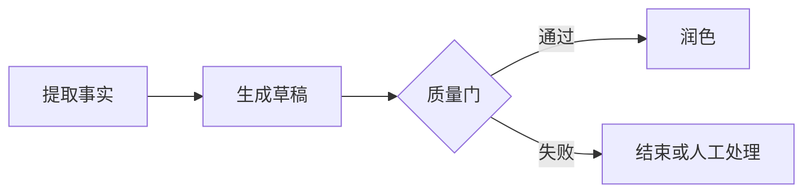
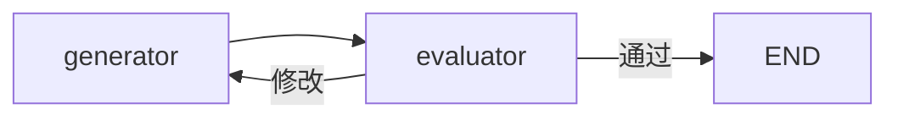

# 13. 运行图设计模式

运行图设计模式不是必须套用的模板，而是对常见 LLM 工作流的归纳。选择模式时先看任务是否能预先确定步骤、是否需要并行、是否需要动态拆分，以及模型是否可以自主决定下一步。

## 13.1 模式总览

| 模式 | 核心结构 | 适用场景 |
| --- | --- | --- |
| Prompt Chaining | 固定步骤顺序执行 | 每一步目标明确的加工流程 |
| Parallelization | 多个独立任务并行后汇总 | 多视角分析、投票、批处理 |
| Routing | 分类后进入专用路径 | 客服分流、模型选择、任务分类 |
| Orchestrator-worker | 动态拆分 N 个任务再汇总 | 报告、代码库分析、动态章节生成 |
| Evaluator-optimizer | 生成、评价、修改循环 | 有明确质量标准的内容优化 |
| Agent | 模型动态决定工具和步骤 | 步骤无法预先确定的开放任务 |

复杂度从左到右通常逐渐增加。能用固定工作流解决时，不要默认使用 Agent。

## 13.2 Prompt Chaining：提示词链

把任务拆成固定阶段，每一步使用上一步结果：



```python
builder.add_edge(START, "extract")
builder.add_edge("extract", "draft")
builder.add_conditional_edges(
    "draft",
    quality_gate,
    {"pass": "polish", "fail": END},
)
builder.add_edge("polish", END)
```

适合翻译、摘要、格式转换、固定审核流程。优点是可预测和易测试；缺点是步骤固定，错误可能沿链传播。

设计要点：每一步使用结构化输出，质量门基于明确规则，不把上一步的全部原始上下文无条件复制到下一步。

## 13.3 Parallelization：并行化

多个任务互不依赖时并行执行，再统一汇总：

```python
builder.add_edge(START, "analyze_risk")
builder.add_edge(START, "analyze_cost")
builder.add_edge(START, "analyze_value")
builder.add_edge(
    ["analyze_risk", "analyze_cost", "analyze_value"],
    "aggregate",
)
builder.add_edge("aggregate", END)
```

两种常见用途：

- **Sectioning**：不同节点负责不同子任务。
- **Voting**：多个模型或 Prompt 独立回答，再投票或评审。

适合多维度分析、并行检索和批量处理。必须处理并行 State Reducer、超时、部分失败和汇总顺序。

## 13.4 Routing：路由

先使用规则或结构化模型分类，再进入专用流程：

```python
from typing import Literal
from pydantic import BaseModel


class Route(BaseModel):
    destination: Literal["billing", "technical", "general"]


router_model = model.with_structured_output(Route)


def classify(state: State) -> dict:
    route = router_model.invoke(state["query"])
    return {"route": route.destination}


builder.add_conditional_edges(
    "classify",
    lambda state: state["route"],
    {
        "billing": "billing_flow",
        "technical": "technical_flow",
        "general": "general_flow",
    },
)
```

适合客服分流、领域模型选择和安全等级分类。

生产路由需要：

- 明确的可选类别，禁止任意节点名。
- 低置信度或未知类别的兜底路径。
- 权限判断由业务代码完成。
- 保存分类结果和依据，便于评测。

## 13.5 Orchestrator-worker：编排器与工作节点

编排器先动态规划任务，再使用 `Send` 创建多个 Worker：

```python
import operator
from typing import Annotated, TypedDict
from langgraph.types import Send


class State(TypedDict):
    topic: str
    sections: list[str]
    drafts: Annotated[list[str], operator.add]
    report: str


def orchestrator(state: State) -> dict:
    plan = planner.invoke(state["topic"])
    return {"sections": plan.sections}


def assign_workers(state: State):
    return [Send("worker", {"section": section}) for section in state["sections"]]


def worker(state: dict) -> dict:
    return {"drafts": [write_section(state["section"])]}


builder.add_edge(START, "orchestrator")
builder.add_conditional_edges("orchestrator", assign_workers)
builder.add_edge("worker", "synthesize")
builder.add_edge("synthesize", END)
```

与固定并行的区别是：Worker 数量和任务内容由运行时规划决定。

适合报告生成、代码库扫描和未知数量文档处理。必须限制 Worker 数量、并发、Token、总成本和单任务超时，并校验编排器生成的任务是否合法。

## 13.6 Evaluator-optimizer：评估与优化

生成器产生结果，评估器判断是否达标，不达标则带反馈重新生成：



```python
def route_evaluation(state: State):
    if state["passed"]:
        return END
    if state["attempts"] >= 3:
        return "manual_review"
    return "generator"


builder.add_edge(START, "generator")
builder.add_edge("generator", "evaluator")
builder.add_conditional_edges("evaluator", route_evaluation)
```

评估器最好返回结构化结果：

```python
class Feedback(BaseModel):
    passed: bool
    score: float
    problems: list[str]
    suggestions: list[str]
```

适合代码、文案和报告优化。必须设置最大轮次、质量阈值和人工兜底。评估 Prompt 与生成 Prompt 应尽量独立，重要场景结合规则、测试或人工评审，不能只依赖另一个模型的主观判断。

## 13.7 Agent：智能体循环

Agent 让模型根据当前消息决定调用哪个工具以及是否继续：

```python
from langgraph.prebuilt import ToolNode, tools_condition


def call_model(state: MessagesState):
    return {"messages": [model_with_tools.invoke(state["messages"])]}


builder.add_node("model", call_model)
builder.add_node("tools", ToolNode(tools))
builder.add_edge(START, "model")
builder.add_conditional_edges("model", tools_condition)
builder.add_edge("tools", "model")
```

适合步骤无法预先确定、需要根据工具结果持续决策的任务。

Agent 的自由度最高，风险也最高，必须增加：

- Tool Allowlist 和参数 Schema。
- 用户/租户权限和资源归属校验。
- 最大步骤、Tool 次数、Token、成本和总耗时。
- 危险操作人工审批。
- 写操作幂等和未知状态处理。
- 完整 Trace、测试集和回归评测。

## 13.8 如何选型

按以下顺序判断：

```text
步骤是否固定？
  是 -> Prompt Chaining
  否
任务是否可独立并行？
  固定数量 -> Parallelization
  动态数量 -> Orchestrator-worker
是否只是选择专用路径？
  是 -> Routing
是否需要反复改进到达质量线？
  是 -> Evaluator-optimizer
是否必须让模型动态决定工具与步骤？
  是 -> Agent
```

模式可以组合，例如：先 Routing 选择领域子图，子图内部使用 Orchestrator-worker，最终进入 Evaluator-optimizer。但组合越多，状态、成本和失败路径越难控制。

## 13.9 通用生产检查

1. 每个节点有单一职责和稳定输入输出。
2. 路由使用有限枚举和兜底路径。
3. 循环有业务终止条件和最大次数。
4. 并行字段定义正确 Reducer。
5. 外部调用配置超时、有限重试和幂等。
6. State 不保存无关大对象和敏感数据。
7. 关键节点支持 Trace、Metrics 和结构化日志。
8. 对正常、边界、失败、中断和恢复路径分别测试。
9. 先选择最简单可控的模式，再逐步增加自主性。
