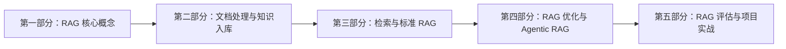

# RAG 开发实战学习路径

本目录按照 RAG 的知识体系重新组织。每个阶段先学习原理，再阅读代码和执行实验，最后通过评测验证结论。

## 学习路线

## 当前文档

### [x] 第一部分：RAG 核心概念与核心组件

- 文档：[01-RAG基础概念与核心组件.md](01-RAG基础概念与核心组件.md)
- 内容：RAG 基础概念、工作流程、Embedding、向量数据库、RAG 与微调/长上下文的区别
- 目标：能够解释 RAG 为什么有效，画出完整数据流，并理解每个组件的责任边界

### [x] 第二部分：RAG 技术实现

- 文档：[02-RAG技术实现.md](02-RAG技术实现.md)
- 实践：[practice/RAG开发实战/01-document-processing](../../practice/RAG开发实战/01-document-processing/README.md)、[practice/RAG开发实战/02-vector-store](../../practice/RAG开发实战/02-vector-store/README.md)、[practice/RAG开发实战/03-rag-chain](../../practice/RAG开发实战/03-rag-chain/README.md)
- 内容：文档处理、批量向量化、向量存储、检索策略、查询增强、上下文组装和输出控制
- 目标：能够使用主流框架实现一条带权限过滤、来源引用和无答案拒答的 RAG Chain

## 后续文档

后续按照你提供的框架继续补充：

- 第二部分：文档加载、清洗、切分和知识库构建
- 第三部分：Retriever、Top-K、阈值、混合检索、重排序和标准 RAG
- 第四部分：查询增强、RAG 优化、Agentic RAG 和高级架构
- 第五部分：检索评估、生成评估、性能成本和完整项目实战

## 配套练习

当前代码练习仍保留在 workspace 的原目录中，后续会按照新的文档章节重新调整说明和对应关系：

- [文档处理练习](../../practice/RAG开发实战/01-document-processing/README.md)
- [向量存储练习](../../practice/RAG开发实战/02-vector-store/README.md)
- [标准 RAG Chain 练习](../../practice/RAG开发实战/03-rag-chain/README.md)
- [Agentic RAG 练习](../../practice/RAG开发实战/04-agentic-rag/README.md)
